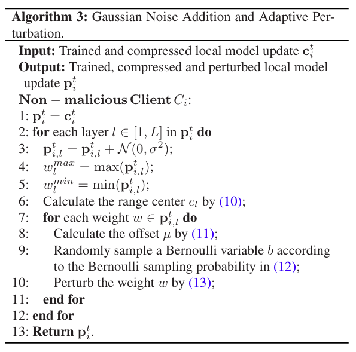

# Efficient and secure federated learning against backdoor attacks -- 高效且安全的可抵御后门攻击的联邦学习

## 论文来源
|名称 |	Efficient and secure federated learning against backdoor attacks|
|-|-|
| 期刊| [TDSC 2024](https://ieeexplore.ieee.org/document/10400872)|
| 作者 |	Yinbin Miao；Rongpeng Xie；Xinghua Li；Zhiquan Liu, Member, IEEE；Kim-Kwang Raymond Choo , Senior Member, IEEE；Robert H. Deng , Fellow, IEEE|
|DOI |	DOI: 10.1109/TDSC.2024.3354736|

## 问题背景  
- 隐私泄露: 联邦学习（FL）中，客户端上传的模型更新（即使不是原始数据）也可能泄露其本地数据的敏感信息。
- 后门攻击: 由于FL的分布式特性，恶意客户端可以上传带有==后门触发器==的模型更新，使得最终的全局模型在遇到特定触发器时产生错误输出。
- 通信开销: DNN（Deep Neural Networks）模型参数量巨大，导致客户端上传模型更新时产生高昂的通信成本。
- 本地差分隐私 (LDP) 的局限性:
	- 非自适应性: 传统LDP方法（如添加高斯噪声）通常对**所有参数**施加相同强度或随机强度的噪声，可能对关键参数造成过度扰动，严重损害模型效用。一些改进方案（如[[LDP-FL]](https://arxiv.org/abs/2007.15789)）虽考虑了分层特性，但仍不够精细（例如，同一层参数仅扰动到两个固定值）。
	- 效用损失: 为了抵抗后门攻击，有时需要较强的噪声，这会进一步降低模型准确率。
## TLDR
论文提出了一种名为 ESFL 的方案，通过结合 **自适应本地差分隐私 (Adaptive LDP)**   和 **压缩感知 (Compressive Sensing, CS)** 来应对上述挑战。
- **自适应 LDP** 核心思想:
	- 两阶段噪声添加:
		1. 首先，在本地对模型参数（或更新）添加传统的高斯噪声，这为抵抗后门攻击提供基础防御。
		2. 然后，利用一种更精细的自适应扰动函数来“调节”已添加的高斯噪声。这个自适应函数会考虑DNN模型每层参数的实际分布（计算每层的范围中心 $c_l$ 和半径  $r_l$），并根据每个参数值与其层范围中心的偏移量 $\mu$ 来进行扰动。这种方法旨在更智能地控制噪声的规模，减少对模型效用的过度损害。论文强调了先加高斯噪声再进行自适应调节的顺序至关重要。
- **压缩感知** (CS):
	- 在客户端对模型更新进行噪声扰动之前，先使用**离散余弦变换 (DCT)** 和 **压缩感知技术** 对其进行压缩，从而显著减少上传到服务器的数据量，降低通信开销。
	- 服务器在聚合了所有客户端的压缩更新后，再进行 **一次性的解压缩** 。

## 系统及威胁模型
### 实体
系统结构如图：

- 服务器作为聚合器，负责收集 $N_t$ 个本地模型更新并将其聚合为全局模型更新以优化全局模型。在本文方案中，它还需要执行解压操作。
- 非恶意客户端是隔离的设备，负责在干净数据集上进行本地模型训练、压缩和噪声添加。
- 恶意客户端将使用其选择的触发器在有毒数据集上进行本地模型训练，然后在上传之前压缩并放大模型更新。并且，**他们不添加噪声** 。

### 威胁模型

- 服务器是半诚实的，它诚实地聚合所有上传的本地模型更新，不会遗漏任意一个客户端的数据，但它可以通过在每个通信回合中跟踪本地全局模型更新来侵犯客户端隐私，从而推断出关于任何客户的信息。
- 客户端被分为两类：半诚实和恶意。前者诚实地遵循算法，但从全局模型中推断其选择的受害者的私人信息。后者则在其数据注入或改变带有精心设计触发器的实例，并使用后门训练有害模型。
- 本文的威胁可以总结如下：
	- 客户端数据隐私泄露：如果模型更新以明文形式传输，半诚实的服务器和半诚实客户端可能会推断出训练数据的私人信息。
	- 后门攻击：对于恶意客户端，他们会对模型训练过程发起后门攻击，使模型误分类带有触发器的输入。
	- 模型效率降低：后门攻击可能导致部分测试样本被误分类，从而损害模型的效用。

## 方法展开
### 服务器初始化
- 服务器会对所有客户端发放一个初始模型。
- 此外，服务器会为客户端模型的每一层协商一个数值区间：$[ c_l-r_l , c_l + r_l ]$ 以及一对集合 $(C,R)$，其中 $l\in [1,L]$ ，$L$  表示网络层数，$C$ 表示包含 $L$ 个范围中心的集合，$R$ 表示包含 $L$ 个对应范围半径的集合。
### 本地更新
在每一轮，服务器从 $N$ 个客户端中选定 $N_t$ 个客户端参与训练。
如果是恶意客户端，在训练结束后会进行后门攻击。

### 本地压缩
客户端更新训练之后，会对参数改变量进行参数压缩，压缩率为 $CR\in (0,1)$ ，将每一层的参数量以相同的压缩率进行参数压缩。

### 高斯噪声与自适应扰动
在非恶意客户端得到 $c_i^t$ 后，为了抵御后门攻击，非恶意客户端首先为每一层的参数添加高斯噪声。然后进行自适应噪声的添加：
- 客户端首先计算每层的范围区间 $[ c_l-r_l , c_l + r_l ]$:

- 然后计算偏移：$\mu$
$\mu = w-c_l$
- 如果改写上式： $w=c_l+\mu$ ，可以发现权重 $w$ 的扰动本质上是偏移量 $\mu$ 的扰动。
- 类似LDP-FL，ESFL将扰动函数 $M$ 设计为分段函数，根据不同条件以不同方式扰动不同的权重。
	 - 首先，基于隐私预算计算伯努利变量 $b$ 的分布概率：

 	- 然后非恶意客户端从满足上述概率的伯努利分布中随机抽样，并按如下方式扰动权重 $w$.

### 聚合与解压缩
在非恶意客户端 进行本地训练、压缩和添加噪声后，它将压缩后的扰动本地模型更新 $p_i^t$ 上传至服务器。需要注意的是，恶意客户端不会对其 $c_i^t$ 添加噪声。
- 当服务器收集到 $N_t$ 个本地模型更新后便开始聚合，然后再进行解压缩。
- 压缩的全局模型：$y^t=\sum_{i=1}^{N_t}p_i^t$。
在算法 4 中，用 $y_{*,l}^t$ 表示 $y^t$ 的第 $l$ 层权重，用 $\Delta w_{*,l}^t$ 表示最终完整全局模型更新 $\Delta w^t$ 的第 $l$ 层更新。
- 服务器首先计算第 $l$ 层权重的压缩数 $m_l$，然后根据压缩比 $CR$ 获取原始数字 $n_l$，最后在逆离散余弦变换后对 $y_{*,l}^t$ 进行解压。在获得 $L$ 个重构的 $\Delta w_{*,l}^t$ 后，服务器将其组装成完整的全局模型更新 $\Delta w^t$，并更新全局模型 $w^t = w^{t−1} + \frac{\varsigma}{N} \cdot \Delta w^t$ 。

### 总体算法
ESFL的总体流程如图：

总体算法如：

## 总结
- ESFL通过巧妙地结合自适应LDP和压缩感知，在抵抗后门攻击、保护隐私、维持模型效用和提高通信效率方面取得了显著的平衡和改进。然而，这种平衡是以增加一定的计算复杂度和参数调优难度为代价的，并且仍受到差分隐私和有损压缩固有局限性的影响。
### 优点  
- 增强的后门攻击防御能力  
	- 通过高斯噪声和自适应扰动的两阶段机制，ESFL能比仅依赖一种噪声或简单自适应机制（如CAFL）更有效地抵抗后门攻击，其攻击成功率 (ASR) 较低。
	- 自适应机制使得噪声能更好地针对潜在的恶意操纵进行调整。
- 改进的隐私保护下模型效用  
	- 相较于传统的、非自适应的本地差分隐私 (LDP) 方法（如仅添加固定强度或随机高斯噪声），ESFL的自适应扰动机制能更精细地控制噪声，减少对模型关键参数的过度损害，从而在保证 $\epsilon$-LDP 的同时，更好地保持模型在主任务上的准确率。
- 通信效率高  
	- 通过采用压缩感知 (CS) 和离散余弦变换 (DCT)，在客户端上传模型更新前对其进行压缩，显著减少了上行链路的通信开销，这对于资源受限的客户端和大规模联邦学习系统尤为重要。
- 更精细的自适应性 
	- ESFL的自适应扰动不仅考虑了DNN的分层特性，还考虑了每层内每个参数相对于该层范围中心的偏移量，实现了比先前方案（如[9]中将同一层参数扰动到固定两个值）更细致的噪声控制。
- 形式化的隐私保障  
	- 论文提供了ESFL满足 $\epsilon$-LDP 的形式化数学证明。
### 缺点  
- 增加的计算复杂度  
	- 客户端: 需要执行DCT、CS压缩以及两阶段的噪声添加，比简单加噪方案计算量更大。
	- 服务器端: 需要执行CS解压缩（包括聚合后的恢复和IDCT），这可能比简单聚合更耗时。
	- 自适应扰动需要计算每层的参数范围中心和半径，也带来额外开销。
- 参数调优的复杂性 
	- ESFL引入了多个需要仔细调整的超参数，如隐私预算 $\epsilon$、压缩率CR、高斯噪声的标准差等。这些参数的最优选择可能依赖于具体任务、数据集和模型架构，找到最佳组合可能具有挑战性。
- 压缩感知的固有局限性 
	- CS是一种有损压缩技术。虽然DCT有助于提高模型更新的稀疏性，但并不能保证完美恢复，尤其是在压缩率较高或模型更新并非高度稀疏时。恢复误差可能会影响最终模型的精度。
	- CS恢复算法本身的计算开销也可能较大。
- 噪声的固有影响 
	- 尽管ESFL致力于优化噪声的添加，但任何差分隐私机制引入的噪声都会不可避免地对模型效用造成一定程度的损害，相较于没有隐私保护和攻击的理想情况，准确率仍会有所下降。
- 对模型和数据特性的依赖  
	- DCT对模型更新的稀疏化效果可能因模型结构和数据特性的不同而异，这会影响CS的压缩性能和恢复质量。
	- 自适应扰动的有效性也依赖于对各层参数范围的准确估计。
- 防御范围的特定性 
	- ESFL主要针对特定的后门攻击进行设计和优化。虽然LDP提供了通用的隐私保护，但其针对其他类型的攻击（如更广泛的投毒攻击、模型推断攻击等）的防御效果可能需要进一步评估。
