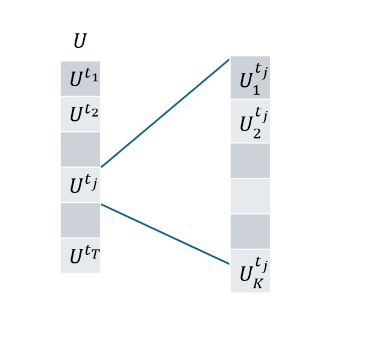
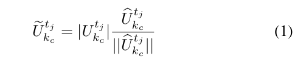
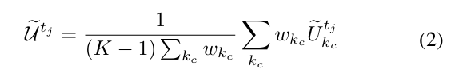
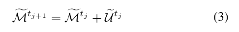
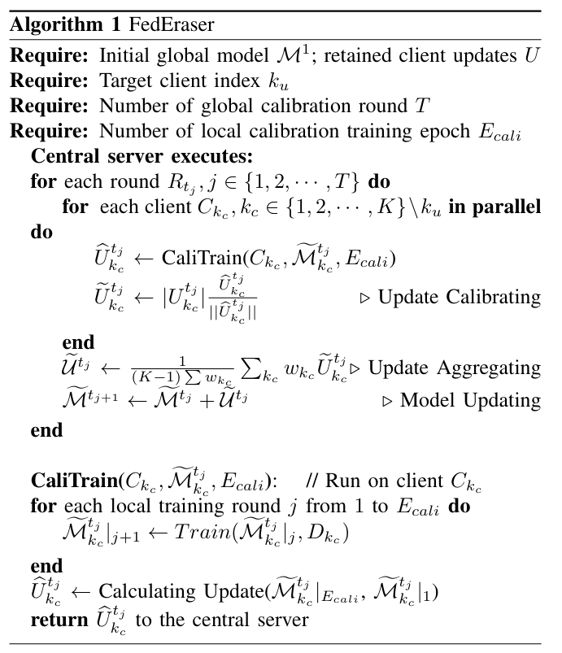

# FedEraser: Enabling efficient client-level data removal from federated learning models -- 实现联邦学习模型中高效的客户端级数据删除

## 论文来源
|名称 |	[FedEraser: Enabling efficient client-level data removal from federated learning models](https://ieeexplore.ieee.org/document/9521274)        |
|-|-|
| 期刊| [IWQOS 2021](https://ieeexplore.ieee.org/document/9521274)         |
| 作者 |	Gaoyang Liu, Xiaoqiang Ma, Yang Yang, Chen Wang, Jiangchuan Liu      |
|DOI |	DOI: 10.1109/IWQOS52092.2021.9521274    |

--------------------------
    这是第一篇联邦遗忘论文，但是完成度还是不错的。
----------------------------

## 背景
- 现有机器学习领域中的遗忘学习技术由于联邦学习与机器学习在数据学习方式上的固有差异，无法直接用于联邦学习。
- 一种朴素的满足请求删除的方法是，在移除目标数据后，仅使用剩余数据从头重新训练模型。然而，对于许多应用来说，成本（在时间、计算、能源等方面）可能高得难以承受，尤其是在联邦学习（FL）环境中涉及多方参与者之间多轮训练与聚合交替的情况下。

## TDLR
本文中提出了FedEraser，一种高效的联邦遗忘方法，能够消除联邦客户数据对全局模型的影响，同时显著减少遗忘时间。
FedEraser的基本思想是以中央服务器的存储换取未遗忘模型的构建时间，其中FedEraser通过利用在联邦学习训练过程中中央服务器保留的 **客户历史参数更新** 来重构未遗忘模型。由于保留的更新源自包含目标客户数据影响的全局模型，因此在使用这些更新进行遗忘之前，必须对其进行 **信息解耦** 的校准。基于客户更新指示全局模型参数需要朝哪个方向变化以使模型适应训练数据的事实，我们进一步通过仅进行少量轮次的校准训练来校准保留的客户更新，以近似无目标客户情况下的更新方向，并可利用校准后的更新迅速构建未遗忘模型。

## 方法展开
### 历史信息保留
目标客户端发出遗忘求情之后，服务器为了实现联邦遗忘，会每隔 $\Delta t$ 轮就保留客户端的更新而不删除。服务器保留的更新集合记为 $U$ 。

$$U=\{U^{t_1},U^{t_2},...,U^{t_T}\}$$

其中 $U^{t_j}$  表示第j个时间间隔服务器所保留的信息，而 $U^{t_j}=\{ U _1^{t_j},U _2^{t_j},...,U _K^{t_j} \}$ 。

FedEraser的遗忘算法主要包含四个阶段：
1. 校准训练 （calibration
 training）
2. 更新校准 （updatecalibrating）
3. 校准更新聚合 （calibratedupdateaggre
gating）
4. 遗忘模型更新 （unlearnedmodelupdating）

**FedEraser的正常训练与联邦学习正常训练无异，故下述内容只讨论如何实现遗忘**

### 联邦遗忘

1. 校准训练

在非目标客户端 $C_{k_c}$ 上执行：

$C_{k_c}$ 下载当前（或上一轮FedEraser迭代后的）全局模型 $M_{t_j}$。

$C_{k_c}$ 在其本地数据上，基于 $M_{t_j}$ 进行少量轮次 ( $E_{cali}$ ) 的本地训练。

生成新的“校准更新” $\hat{U}_{k_c}^{t_j}$ ，并上传至服务器。

2. 更新校准

在中央服务器上执行：
服务器取出历史上为 $C_{k_c}$ 在轮次 $t_j$ 保留的原始更新 $U_{k_c}^{t_j}$ 。
核心公式 (1)：

含义： 保留历史更新 $U_{k_c}^{t_j}$ 的模长 (magnitude/strength)，但将其方向 (direction) 替换为新校准更新 $\hat{U}_{k_c}^{t_j}$ 的方向。

目的： 利用历史的“贡献强度”和当前的“正确方向”来修正历史更新。

3. 校准后更新聚合

在中央服务器上执行：

聚合所有校准客户端 $C_{k_c}$  在当前轮次  $t_j$的校准后更新 $\tilde{U}_{k_c}^{t_j}$ , 得到聚合更新 $\tilde{U}^{t_j}$ 。

4. 卸载模型更新 

在中央服务器上执行：

更新全局模型：$\tilde{\mathcal{M}}^{t_{j+1}}$ :

$\tilde{\mathcal{M}}^{t_{j+1}}$ 将作为下一轮校准迭代的起始模型。

迭代完成： 当所有保留的历史轮次都处理完毕后，得到最终的“已卸载”全局模型。

总体算法如图：

## 总结
### 优点
1. 高效性 
- 显著减少卸载时间： 相比于“从头重新训练”（FedRetrain）这一最直接但耗时的方法，FedEraser 通过利用历史保留更新和少量的校准训练，能够以更少的时间（实验中约4倍加速）完成卸载过程。
- 计算资源节省： 由于校准训练的轮次较少，并且主要计算发生在中央服务器对历史更新的处理上，整体计算资源消耗低于完全重训练。
2. 有效性 
- 接近理想的遗忘效果： 实验结果表明，FedEraser 卸载后的模型在遗忘效果上（如MIA攻击下的表现、在目标数据上的性能下降）能够接近甚至有时优于从头重新训练的模型。
- 保持模型效用： 在移除目标客户端数据影响的同时，模型在剩余数据和测试集上的整体性能损失较小，能够保持较好的泛化能力。
3. 非侵入性与易部署性  
- 对现有 FL 架构改动小： FedEraser 主要增加了中央服务器保留更新的功能，以及协调校准训练的逻辑。对客户端的训练流程改动很小（仅需支持可能比正常训练轮次更少的校准训练）。
- 可作为可选组件： 可以作为现有联邦学习系统的一个附加功能模块，在需要时启用。
4. 隐私友好  
- “无意执行”： 卸载过程不依赖于目标客户端的任何数据、历史更新或主动参与。
- 对非目标客户端透明： 参与校准的非目标客户端可能并不知道卸载的具体目标和意图，减少了协调复杂性和潜在的博弈问题。
5. 开创性 
- 首个联邦学习卸载方法： 论文声称 FedEraser 是第一个专门为联邦学习场景设计的卸载方法，填补了该领域的空白。

### 缺点

1. 中央服务器的存储开销  
- FedEraser 的核心机制依赖于中央服务器保留历史上多个轮次的客户端模型更新。随着客户端数量、模型大小和保留轮次的增加，这会带来显著的存储压力。论文也承认这是“用存储换时间”的权衡。
2. 历史更新的质量与时效性 
- 如果保留的历史更新质量不高（例如，在训练早期模型尚未稳定时保留的更新），或者与当前模型状态相差过远，校准的效果可能会受到影响。
- 保留间隔 Δt 的选择是一个需要权衡的参数：间隔太小存储开销大，间隔太大可能导致历史信息与当前状态脱节。
3. 校准过程的依赖性 
- FedEraser 仍然需要一部分非目标客户端参与校准训练。如果可用的、愿意参与校准的客户端数量不足，或者它们的本地数据分布与整体有较大偏差，可能会影响校准的准确性和最终卸载效果。
- 虽然校准轮次少，但仍然涉及通信开销。
4. 对特定 FL 变体的适应性  
- 论文主要在标准的、基于 FedAvg 的横向联邦学习框架下进行评估。对于其他更复杂的联邦学习变体（如纵向联邦学习、联邦强化学习、存在更复杂聚合策略的FL等），FedEraser 的适用性和有效性可能需要进一步研究和调整。
5. 理论保证的缺乏 
- FedEraser 的设计更多是基于启发式和经验观察。虽然实验结果令人鼓舞，但可能缺乏严格的理论分析来保证其在所有情况下的收敛性、遗忘的彻底性或与理想重训练模型的差距上界。
6. 无法处理实例级卸载 
- FedEraser 设计用于移除整个客户端的数据影响。如果需求是移除该客户端数据中的某几个特定样本（实例级卸载），FedEraser 目前的机制无法直接支持。
7. 对恶意校准客户端的鲁棒性 
- 如果参与校准的客户端是恶意的，它们可能会提供误导性的校准更新，从而破坏卸载过程或影响最终模型的性能。论文未深入探讨此方面的安全性。
-----------------------------
FedEraser 作为一个开创性的联邦学习卸载方案，在效率和有效性方面取得了显著的平衡，为解决 FL 环境下的数据遗忘问题提供了一个有前景的思路。然而，它也存在一些实际部署中需要考虑的局限性，例如存储开销和对校准过程的依赖。未来的研究可以在优化这些方面、增强理论保证以及扩展其适用范围上继续深入。