# FedPHE: A Secure and Efficient Federated Learning via Packed Homomorphic Encryption

## 论文来源
|名称 |	FedPHE: A Secure and Efficient Federated Learning via Packed Homomorphic Encryption|
|-|-|
| 期刊 | [TDSC 2025](https://ieeexplore.ieee.org/document/10989521)|
| 作者 | Yuqing Li, Member, IEEE, Nan Yan, Jing Chen, Senior Member, IEEE, Xiong Wang, Member, IEEE,Jianan Hong, Member, IEEE, Kun He, Member, IEEE, Wei Wang, Member, IEEE, and Bo Li, Fellow, IEEE |
|DOI |	[DOI: 10.1109/TDSC.2025.3567301](https://ieeexplore.ieee.org/document/10989521)|

## 问题背景  
- 当使用HE来解决隐私问题时，会引发巨大的通信和计算开销，而**打包同态**（packed HE，PHE）可以将多个密文值打包到一个值里面。
  - 基于单密钥的同态（Paillier、CKKS）存在隐私泄露风险。
  - 过去的PHE并没有考虑客户端异构（统计异构、设备异构）问题
- **权重聚合**虽然考虑了客户端数据量的不同，但由于客户持有的数据集对模型性能的贡献可能存在差异，简单的聚合方法往往会对全局模型造成严重偏差，从而妨碍收敛。
- 在**客户端选择**算法中，因为并非所有客户端的重要性相同，通过识别具有高质量数据的快速客户端并将其纳入训练过程，可以有效解决滞后者问题，而不影响模型的准确性。
  - 现有的客户选择方法主要在明文下进行，并且需要直接访问本地模型更新，这引发了联邦学习中的隐私问题。

## TLDR
- 本文提出了一种名为FedPHE的安全高效的基于打包同态加密（PHE）的联邦学习（FL）框架，以应对与安全威胁和客户异质性相关的挑战。
- FedPHE开发了一种基于共享感知的安全聚合方案，利用了支持同态乘法的打包CKKS技术。
  - 参数服务器（PS）将选定客户端的加密本地更新与反映其对全局模型贡献的加密权重进行聚合，从而促进模型快速吸收新知识，加速训练收敛。 
  - 鉴于原始CKKS通常会生成大幅度扩大的密文，本文使用基于打包的稀疏化方法来优化周期性加密联邦学习同步期间的数据传输效率。
  - 为了增强针对诚实但好奇敌手的隐私保护，本文采用基于秘密共享的盲化技术，将个体更新与随机因子混合以进行掩蔽，之后再恢复并移除该随机因子，以获得正确的聚合结果。
  - 为缓解延迟节点效应，FedPHE 设计了一种基于小样本的客户端选择方案，以审慎地选择既具有快速训练能力又承载多样化模型的客户端。

## 系统架构
FedPHE由三种实体组成：一个密钥分发中心（KDC）、一个中央参数服务器PS以及N个客户端。

在协作模型训练过程中，客户端与PS之间通过**不安全通道**进行数据交换。

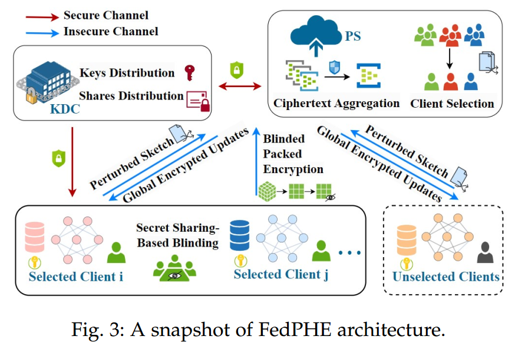

## 威胁模型
- KDC被视为完全可信。
- PS和客户端被假定为诚实但好奇。也就是说，他们会诚实地遵循协议设计，但对每个客户端的私有数据感到好奇。
- 在本文的威胁模型设置中，诚实但好奇的客户端可能会尝试窃听和解密加密的本地更新，或串通以获取某个客户端的私有数据，但他们不会发起中毒攻击。本文考虑了一个更为实际的威胁模型，其中通信渠道不安全。尽管TLS/SSL协议建立了安全通道，但它们仍然容易受到内部对手、被攻陷的参与者或潜在密钥泄露的威胁。

## 协议展开

### 流程概述
1. 密钥分发：KDC每隔 $\tau$ 轮便将更新的密钥 $\{sk,pk\}$ 和扰动向量 $\mathcal{V}_c$ 以及 $\{\mathcal{V}_{s,i}\}_{i \in \mathcal{N}}$ 分发给客户端;
2. 本地训练：在第 $t$ 轮联邦学习的开始，每个客户端  $i \in \mathcal{N}$  进行 $E$ 步局部随机梯度下降，以计算局部更新  $g_i^t$ ;
3. 本地更新的扰动小样本： 客户端 $i \in \mathcal{N}$ 使用从 KDC 接收到的向量 $\mathcal{V}_c$、$\mathcal{V}_{s,i}$ 计算局部更新 $g_i^t$ 的扰动小样本 $\tilde{h}_i^t$，并发送至 PS;
4. 通过聚类小样本的客户端选择：PS通过去除个性化扰动来恢复原始小样本，并对其进行聚类，以选择一部分客户 $S^t$ 作为参与者，其中每个选定客户的聚合权重 $p_i^t$ 是基于其贡献得出的；
5. 打包加密与稀疏化和盲化：KDC 计算并分发本地盲化因子 $\{\Delta_i\}_{i \in S^t}$ 给选定的客户端。每个选定的客户端 $i \in S^t$ 通过将本地更新 $g_i^t$ 打包成 $\{P_i^1, \ldots ,P_i^K \}$ 来执行稀疏化，并使用 $\Delta_i$ 对稀疏打包的本地更新进行盲化；之后，它对盲化后的打包本地更新进行加密，并将密文 $\mathcal{C}_i^t$ 以及掩码 $M_i^t$ 发送至聚合服务器（PS）；最后，它与其他选定客户端协作以检索盲化因子 $R$，并将其发送给集群内未选定的客户端;
6. 加密加权聚合：PS 聚合接收到的加密本地更新和加密权重，然后计算聚合并向所有客户端分发加密的全局更新 $C^t$ 和掩码 $M^t$；
7. 解密与模型更新：每个客户端对加密的全局更新进行解密、去盲和解包，然后执行本地模型更新。

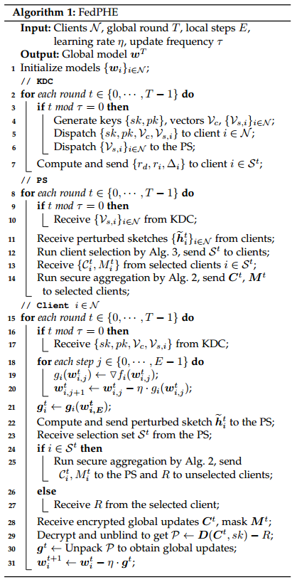

**更多细节如下所述：**

### 贡献感知的高效安全聚合
基于带有稀疏化和盲化的PHE，FedPHE对来自选定客户端的密文执行高效的安全聚合，如算法2所示。聚合权重根据本地更新对全局更新的贡献进行调整，以适应客户端的异质性。

下面分点介绍该聚合算法的构成
#### 基于CKKS的PHE
为了提高通用同态加密方案的效率，PHE 通过将多个明文值 $\{g_1, g_2, \ldots, g_B\}$ 打包并加密为一个密文，其中 $B$ 为打包大小。

> CKKS 通过将多个向量元素直接打包到一个多项式中，提高了加密和解密操作的效率，从而增强了密码学过程的整体效能。
> 
> 图 4 简明地展示了这一打包过程。
> 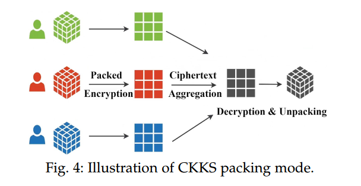

尽管具有如此优势，基于 CKKS 的 PHE 仍然会产生较高的通信开销，并且还存在密文可能被诚实但好奇的客户端解密的风险。为了进一步提高其效率和安全性，需要联合实施基于 *包级稀疏化* 和 *基于秘密共享的盲化* 方案。

#### 包级稀疏化
> 稀疏化是一种有前景的方法，可用于减少联邦学习（FL）训练中的通信流量。在 $top-k$ 稀疏化中，每个客户端可以仅选择发送前 $k$ 个模型更新到参数服务器（PS），以稀疏化其模型更新。

每个选定的客户端 $i$ 首先对本地模型进行 **展平** 和 **打包**，然后根据稀疏化比例 $\zeta$ 确定稀疏化掩码。对于拥有前 $\zeta$ 比例的最大 $L2$ 范数值的打包单元，其稀疏化掩码将被设置为 1，相应地对这些打包单元进行盲化和加密。加密后的密文 $\mathcal{C}_i^t$ 及其对应的稀疏化掩码 $M_i^ᵗ$ 将被发送至参数服务器（PS）。

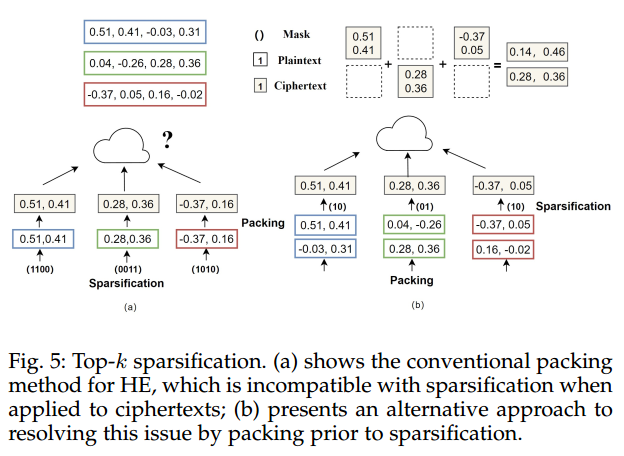

#### 基于秘密共享的盲化
尽管同态加密（HE）允许在加密数据上进行计算，但仍然面临密文被诚实但好奇的客户端拦截并解密的安全威胁。为了解决这些安全问题，本文提出了一种基于 Shamir 秘密共享的盲化机制，将一个秘密盲化拆分成多个份额并分发给各客户端，从而在发送至参数服务器（PS）之前安全地盲化稀疏打包的本地更新。当拥有盲化份额的足够数量客户端协同工作时，该秘密即可被正确重构。

**$(th, |\mathcal{S}^t|)$ Shamir门限秘密共享**

每个被选中的客户端 $i$ 会接收到一个盲化数 $r_i$（秘密），并构造一个次数为 $th - 1$ 的多项式 $F_i(x)$，其常数项为 $r_i$（即 $F_i(0) =r_i$），其余系数从有限域 $p$ 中随机选择，记作 $a_1, a_2, \cdots, a_{th}$。即：

$$
F_i(x) = r_i +a_1 x + a_2 x^2 + \cdots + a_{th} x^{th-1} \ (mod \  p)
$$

其中 $th < |\mathcal{S}^t|$ 被称为阈值。

然后客户端根据 $F_i(x)$ 将 $r_i$ 分成 $|\mathcal{S}^t|$ 份份额 $\{r_{i,j}\}_{j\in \mathcal{S}^t}$，并与其他人交换。在解密全局更新后，每个客户端执行解盲化操作来计算 $\tilde{r}_i = \sum_{j=1}^{|\mathcal{S}^t|} r_{j,i}$，然后通过拉格朗日插值法协同恢复 $\sum_{i \in \mathcal{S}^t} r_i$ 作为 $r$，即:

$$
r=\sum_{i \in \mathcal{S}^t} r_i = \sum_{i=1}^{th}\tilde{r}_i \cdot \Pi_{j=1,j \ne i}^{th} \frac{x - x_j}{x_j - x_i}
$$

利用该公式可以使客户端能够在已知至少 $th$ 份份额的情况下，构造出原始多项式 和 累积盲化值 $r$，而无需向彼此披露各自的盲化数值。

为了减少秘密份额交换时的隐私泄露风险，KDC进一步会生成唯一的盲化数 $r_d$ ，然后采用轻量级的加性秘密共享协议，将本地盲化因子 $\{\Delta_i\}_{i\in \mathcal{S}^t}$ 安全地分发给客户端。

在准备对数据进行盲化时，客户端 $i$ 将其由 KDC 提供的唯一盲化因子 $\Delta_i$ 进行组合。**在加密前**，客户端会将这个本地盲化因子 $\Delta_i$ 加到经过稀疏化筛选后的数据包上 。在解密全局更新后，它会减去全局盲化因子 $R = r + r_d$ 以去除盲化效果。该双层盲化方案为防止未经授权的数据访问提供了有力保障，并增强了分布式秘密共享系统的隐私性。

#### 贡献感知的加权聚合
为适应客户端的异质性，参数服务器（PS）使用加密权重对所选客户端的加密本地更新进行聚合，这些权重反映了它们对全局模型的贡献。这里，客户端 $i$ 的贡献基于其在上一轮和当前轮的小样本相似性 $\{h_i^{t-1}, h_i^t\}$ 进行量化。

**局部敏感哈希（Locality-Sensitive Hashing, LSH）** 已在许多应用中被广泛用于近似计算。杰卡德相似度，即 $JS(X, Y) = |X \cap Y| / |X \cup Y|$。PS 通过计算小样本碰撞的概率来估计两次本地更新的杰卡德相似度，记为 $JS(g_i^{t-1}, g_i^t)$，即：

$$
Pr_{\mathcal{H}}(h_i^{t-1} = h_i^t) = JS(g_i^{t-1}, g_i^t)
$$

两次本地更新的相似度较低意味着推理损失较高，这可能会带来更好的性能，因此应分配更大的聚合权重 $p_i^t$。也就是说:

$$
p_i^t = \frac{exp(-\beta \cdot JS(g_i^{t-1}, g_i^t))}{\sum_{j \in \mathcal{S}^t} exp(-\beta \cdot JS(g_i^{t-1}, g_i^t))}
$$

其中 $\beta$ 是一个用于调整指数函数曲线的**正数**。

基于权重，PS在收到来自选定客户端 $\mathcal{S}^t$ 的密文和稀疏化掩码后，权重聚合可以形式化为：

$$
\begin{align*}
  E(g^{t+1}) & = \sum_{i \in \mathcal{S}^t} E(p_i^t) \times E(g_i^t + \Delta_i)
\\ & = \sum_{i \in \mathcal{S}^t} E(p_i^t) \times E(g_i^t + (r_i + r_{d,i})/p_i^t)
\\ &=E(\sum_{i \in \mathcal{S}^t} p_i^t \times g_i^t + \sum_{i \in \mathcal{S}^t} r_i + \sum_{i \in \mathcal{S}^t} r_{d,i})
\\ &= E(\sum_{i \in \mathcal{S}^t} p_i^t \times g_i^t +r + r_d)
\\ &=E(\sum_{i \in \mathcal{S}^t} p_i^t \times g_i^t +R)
\end{align*}
$$

其中 $E(p_i^t)$ 是分配给客户端 $i$ 的加密权重, $R = r + r_d$ 被称为全局盲化因子。加密的全局更新 $\mathcal{C}_t = \sum_{i \in \mathcal{S}^t} E(p_i^t) \cdot \mathcal{C}_t^i$ 和稀疏化掩码  $M^t = \sum_{i \in \mathcal{S}^t} p_i^t \cdot M_i^t$ 随后被分发给所有客户端进行解密和模型更新。在算法 2 中总结了 FedPHE 如何执行感知贡献的高效安全聚合。

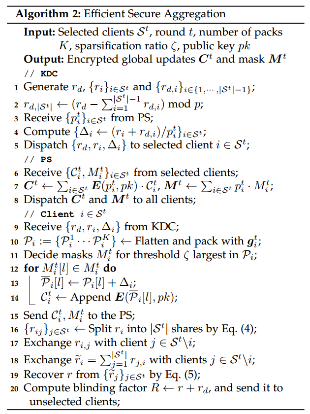

### 基于“小样本”(Sketch) 的抗“掉队者”(Straggler) 客户端选择

不同客户端可能具有相似或冗余的模型更新，从而导致不必要的通信开销。本文利用本地更新的相似性，以隐私保护的方式实现基于小样本的客户端选择, 来应对掉对者效应。

在每一轮中，客户端计算模型更新的小样本，并将其扰动后发送给PS。

PS去除小样本中的个性化扰动，将相似的小样本聚类在一起，并从每个聚类中选择最快的客户端。主要步骤在算法 3 中进行了总结。

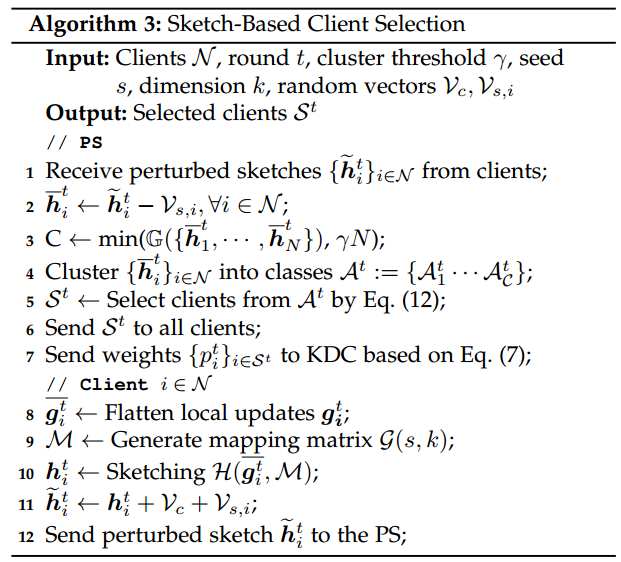

详细过程如下：
#### 带扰动的本地更新小样本化
每个客户端 $i$ 解密并更新模型后， 首先将本地模型更新 $g_i^t$ 展平成一个含 $d$ 个元素的张量 $\bar{g}_i^t$，然后利用共享种子 $s$ 生成一个称为 $\mathcal{M}$ 的 $k \times d$ 的矩阵，该矩阵由 $k$ 个 $d$ 维向量组成。客户端利用局部敏感哈希（LSH） 技术，对  $g_i^t$ 进行降维，得到一个小样本 $h_i^t$ 。

> LSH 是一个函数族 $\mathcal{F}$，其中函数形式为  $\mathcal{H}: \mathbb{R}^d \to \mathbb{S}$ ，其性质是在原始数据空间中相似的两个输入，在经过哈希转换后仍将保持较高的相似性。对于任意两个客户端的模型更新 $g_m$  和  $g_n$ ，从 $\mathcal{F}$ 中均匀随机选取的任一哈希函数 $h$ 都应满足:
> 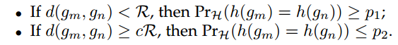
>
> 这里，$c$ 是最近邻搜索的近似比，$\mathcal{R}$ 是到最近邻的距离，$p_1$、$p_2$ 表示满足 $p_1 > p_2$ 的概率。该定义确保如果 $g_m$ 和 $g_n$ 相近，则它们以较高概率（$\ge p_1$）被哈希到同一个桶（碰撞），而它们距离较远时，则以较低概率（$\le p_2$）被哈希到同一个桶。利用 LSH 函数的性质，在发生碰撞时表示两个输入的哈希码高度相似，从而揭示更高的相似性。

> 展平的本地更新 $g_i^t$ 被量化为一个二值矩阵  $\mathcal{M}_{\{0, 1\}}$ ，其中矩阵每个元素在相应的本地更新的值超过阈值 $\varepsilon$ 时赋值为 1，否则赋值为 0。
> 
> 为了计算小样本  $h_i^t$  的第   $m$  元素，我们遍历   $\mathcal{M}_{k \times d}$   的第   $m$   行的每个元素，并将该元素的值作为索引在   $\mathcal{M}_{\{0,1\}}$   中查找第一个出现的 1。如果找到 1，则将对应的值记录在   $h_i^t$   中。
> 
> 尽管小样本所包含的信息有限，但在小样本传输到参数服务器 PS 或被诚实但好奇的客户端获时，仍存在隐私泄露的风险。为防止 PS 推断出小样本，每个客户端都会将一个共享向量   $\mathcal{V}_c$   添加到其小样本    $h_i^t$   中，从而得到扰动后的小样本   $\bar{h}_i^t$  。  $\mathcal{V}_c$    的添加经过精确校准，以确保其最小化，不会干扰诸如 Jaccard 相似度或聚类等操作的准确性。同时，由于 PS 不知道   $\mathcal{V}_c$   ，因此    $h_i^t$   的安全性得以保持。为了进一步防止小样本被截获的可能性，在传输前，还会将一个个性化向量   $\mathcal{V}_{s,i}$  （仅 PS 和客户端   $i$   知道）添加到小样本中。添加的扰动项在有限加法群   $\mathbb{Z}_d$   中进行。因此，即使诚实但好奇的客户端截获了扰动后的小样本   $\hat{h}_i^t + \mathcal{V}_{s,i}$  ，在缺少  $\mathcal{V}_{s,i}$  的情况下，他们也无法获得任何有意义的信息。该安全扰动小样本过程的示意例如图 6 所示，在实际中   $d \gg k$ 。
> 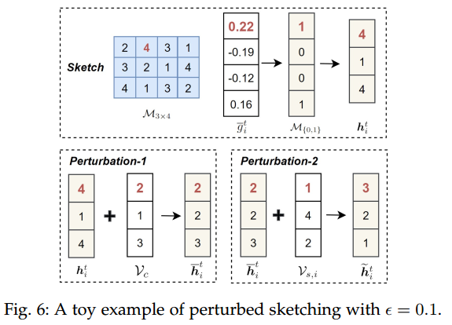

#### 小样本聚类
在接收到来自客户端的本地更新小样本后，PS 去除个性化扰动 $\{\mathcal{V}_{s,i}\}_{i \in \mathcal{S}^t}$，并计算聚类数量  $C = min(\mathbb{G}(\{\bar{h}_1^t, \cdots, \bar{h}_N^t\}), \gamma N)$，其中 $\mathbb{G}(·)$ 表示间隙统计量（gap statistic），这是一种用于确定最优聚类数量的标准技术。

> 间隙统计量将实际簇内差异与基于零参考分布的期望值进行比较，该参考分布是通过蒙特卡罗模拟生成的。这里 $\gamma$ 是限制聚类数量的阈值。 对于任意给定的 $k = 1, ···, k_{max}$，间隙统计定义为:
> $$
\mathbb{G}_n(k)=\mathbb{E}_n^*(logW_k) - log W_k
> $$
> 
> 其中，$W_k$表示聚类内的离散度，通过与参考分布中样本量为$n$时的期望 $\mathbb{E}_n^*$ 进行比较来确定。为修正蒙特罗采样中的误差，可利用参考数据集的个副本计算校正因子$s_k$。令  $\bar{w} = \frac{1}{B} \sum_{b=1}^{B} log(W_{kb∗})。$ 可得标准差$sd(k)$，即 $sd(k) = \sqrt{\frac{1}{B} \sum_{b=1}^{B} (log W_{kb∗} − \bar{w})^2}$ 。定义 $sk = sd(k) \times \sqrt{(1+B)/B}$ 。最后选择满足条件 $\mathbb{G} \ge \mathbb{G}_{k+1} - s_{k+1}$ 的最小 $k$ 作为聚类的个数。

随后，可以使用 $K-means$ 将客户端聚类为 $C$ 个类别 $\{\mathcal{A}_1^t \ldots \mathcal{A}_C^t\}$，其中同一类别的客户端具有相似的小样本。基于 LSH 以高概率将相似输入项哈希到同一桶中的假设，相似的小样本意味着相似的本地更新。

#### 选择客户端
参数服务器（PS）会优先选择一名能够快速训练的代表性客户端，而不是从一个簇中随机选择客户端。

记 $T_i^t$ 为在第 $t$ 轮中，PS 接收到客户端 $i$ 的本地更新的顺序。给定参与历史 $T_0^i, \cdots, T_i^{j-1}$，被选中的优先级 $\mathbb{F}_i^t$ 可由下式确定：  

$$
\mathbb{F}_i^t = \frac{1}{\alpha \delta_{t-1}^i + (1 -alpha) \times T_i^t}
$$
  
其中，$\alpha \in (0, 1)$ 为影响因子，且 $\delta_i^{t-1} = \frac{1}{t} \sum_{j=0}^t T_i^j$ 表示客户端 $i$ 的历史参与表现。若簇中仅包含一个客户端，则直接将该客户端加入选择集 $S^t$。

## 实验
本文使用10个客户端进行模拟实验，为了模拟滞后者的存在，随机选择25%的客户作为滞后者，并引入3−5轮训练时间的人工延迟。批量大小为$B = 64$，学习率为$η = 1e − 3$（CIFAR-100为$1e − 2$）。打包大小和LSH哈希函数的数量分别设置为4096和200。

在四个真实数据集上评估结果：MNIST、FMNIST、CIFAR-10 和 CIFAR100。

MNIST 选择 LeNet-5；FMNIST 选择CNN；CIFAR-10 选择ResNet20；CIFAR-100 选择ResNet32.

图8展示了在不同数据集（即MNIST、FMNIST、CIFAR10和CIFAR-100）上全局模型的训练过程。
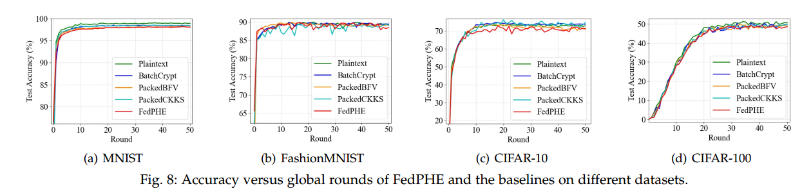

表3中展示了FedPHE和基线在不同数据集上的网络流量和训练时间。
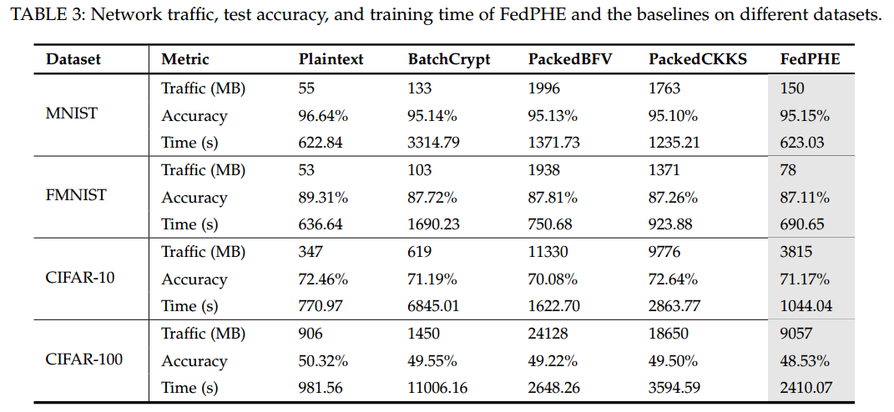

表4比较了在不同非独立同分布水平下，针对MNIST数据集常用的三种稀疏化策略，给定稀疏化比例$\zeta = 70\%$。
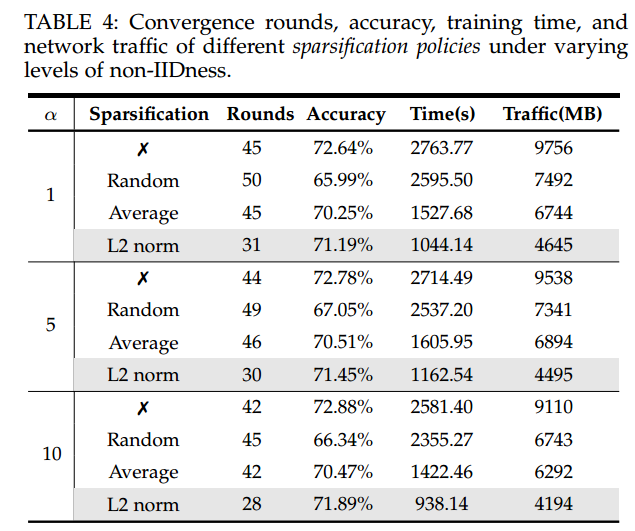

图9展示了稀疏化比率和非独立同分布水平对测试精度的影响的可视化分析。
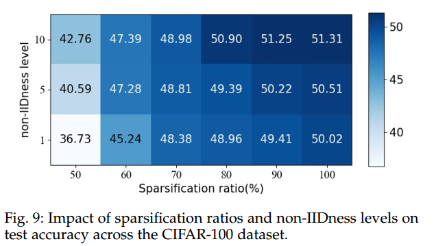

图 10 表明 FedPHE 在测试准确性方面始终优于基线。
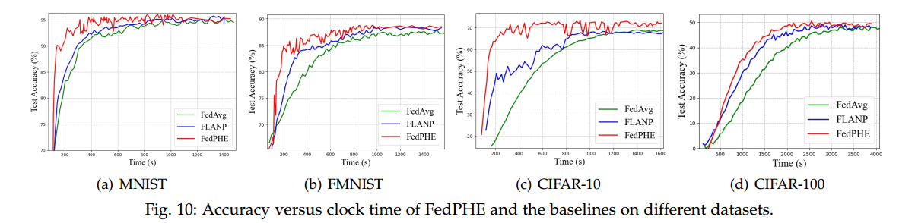

表5在不同的非独立同分布水平下评估了MNIST数据集的不同选择策略。
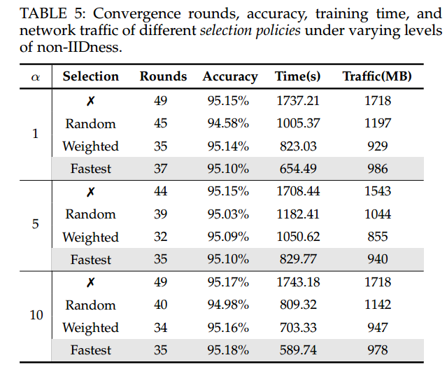

## 总结
这篇论文还是挺复杂的，涉及的技术多、协议复杂，具有一定的参考价值。
- FedPHE 框架通过精巧的设计，不仅解决了同态加密带来的巨大计算和通信开销问题，还增强了传统填充式同态加密（PHE）方案的安全性 。
- FedPHE 在 PHE 联邦学习中同时考虑贡献感知聚合和抗“掉队者”客户端选择。
- 相比于标准的联邦学习或简单的同态加密方案，FedPHE 的协议流程更为复杂。它涉及到“小样本”生成、扰动、聚类、秘密共享、盲化、稀疏化等多个环节，这无疑增加了系统实现和部署的复杂度。