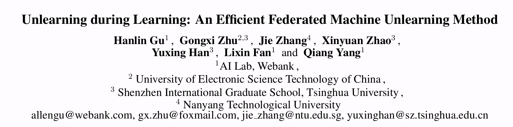

## 论文来源
| 名称  | [Unlearning during learning: An efficient federated machine unlearning method](https://www.ijcai.org/proceedings/2024/0446.pdf) |
| --- | ------------------------------------------------------------------ |
| 期刊  | [IJCAI 2024](https://www.ijcai.org/proceedings/2024/0446.pdf)   |
| 作者  | Hanlin Gu, Gongxi Zhu, Jie Zhang, Xinyuan Zhao, Yuxing Han, Lixin Fan and Qiang Yang|   
| DOI  | https://doi.org/10.24963/ijcai.2024/446  |   
|code|https://github.com/Liar-Mask/FedAU|

## 背景
三种具有代表性的现有联邦遗忘方法已被提出：
- 利用剩余数据头重新训练或微调模型；
- 在遗忘数据上应用梯度上升法以有效降低数据影响；
- 应用模型剪枝技术，选择性地移除模型结构中与遗忘数据高度相关的某些神经元。

但是在实践中，联邦遗忘算法应该具有两个重要的特性：
- 较短的遗忘时间开销；
- 广泛的遗忘能力：一种有效的联邦遗忘方法应具备处理客户端的遗忘请求的能力。能够遗忘特定 **样本** 、**类别** 或 **客户端** 。

然而，现有方法并未同时考虑这两个重要需求。

## FedAU

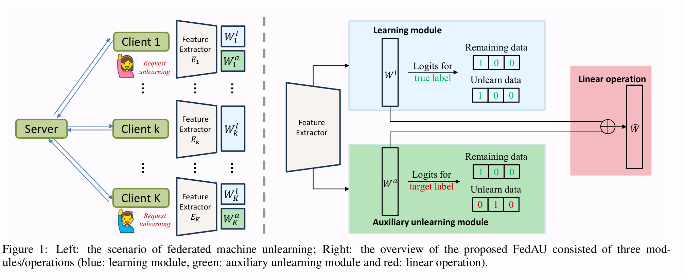

在FedAU中，每个客户端维护三个模块，分别为**特征提取器模块** 、 **分类器学习模块** 和 **辅助遗忘模块**。

	其中，特征提取器就是卷积层，分类器就是全连接层

如图1所示，FedAU的主要方法是在数据集的训练过程中引入一个辅助遗忘模块 $W^a$ 。当客户端请求遗忘特定信息时，可以在学习模块 $W^l$ 和辅助遗忘模块 $W^a$ 之间进行简单的线性操作，例如加权平均，以生成最终的遗忘模型 $\tilde{W}$。

只有客户端 $k$ 需要遗忘时，才会运行辅助遗忘模块，而其他实体（正常训练的客户端和服务器）执行正常的联邦学习操作。

### 学习模块
考虑使用深度神经网络（DNNs）进行有监督分类的任务。令 $Y = \{1, ..., C\}$ 表示标签空间，其中 $C$ 代表类别总数。学习模块旨在优化以下目标：
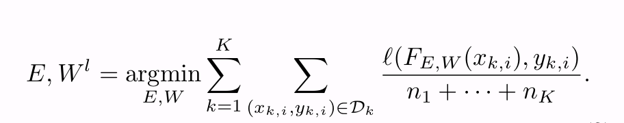
其中，$\ell$ 表示损失函数，例如交叉熵损失，$D_k = \{(x_{k,i}, y_{k,i})\}_{i=1}^{n_k}$ 表示客户端 $k$ 的数据集，大小为 $n_k$。

### 辅助遗忘模块

FedAU 设计了一个辅助遗忘模块 $W^a$ ，该模块由请求遗忘其数据的客户端 $k_0$ 学习。辅助遗忘模块的目标是为客户端 $k_0$ 的特殊数据 $D_{k_0}^{\prime}$ 学习一个特殊模型 $W_{k_0}^a$ ，具体表示为：
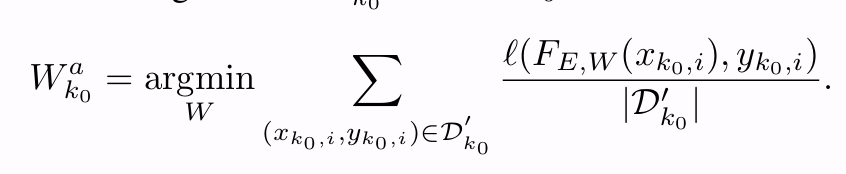

### $W^l$ 和 $W^a$  上的线性运算
遗忘模型 $\tilde{W}$ 需要满足对遗忘数据 $D^u$ 和剩余数据 $D^r = D − D^u$ 两个要求：
1. 遗忘操作不能影响模型在剩余数据 $D^r$ 的准确性。$\tilde{W}$ 关于剩余数据 $D^r$ 的逻辑输出应与$W^l$ 相同，即：
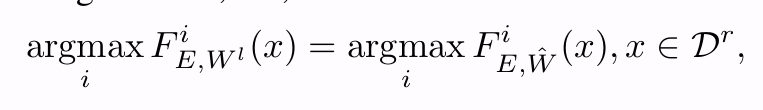
> 其中 $F_{E,W}(x)$ 是训练模型在输入 $x$ 上输出的大小为 $C$ 的对数几率，$F_{E,W}^i (x)$ 是第 $i$ 个对数几率。

2. 模型在遗忘之后对遗忘数据 $D^u$ 应该表现不正确。 $\tilde{W}$ 的逻辑输出应该与遗忘数据 $D^u$ 存在差异，即：
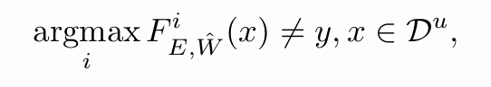
> 其中 $y$ 是 $x$ 的真实标签。换句话说，这一要求表明模型在遗忘后不会记住需要遗忘的数据 $D^u$。

论文观察到，全连接层的特性非常适合论文理论中的线性操作，所以遗忘操作主要在全连接层进行。

## 方案实行
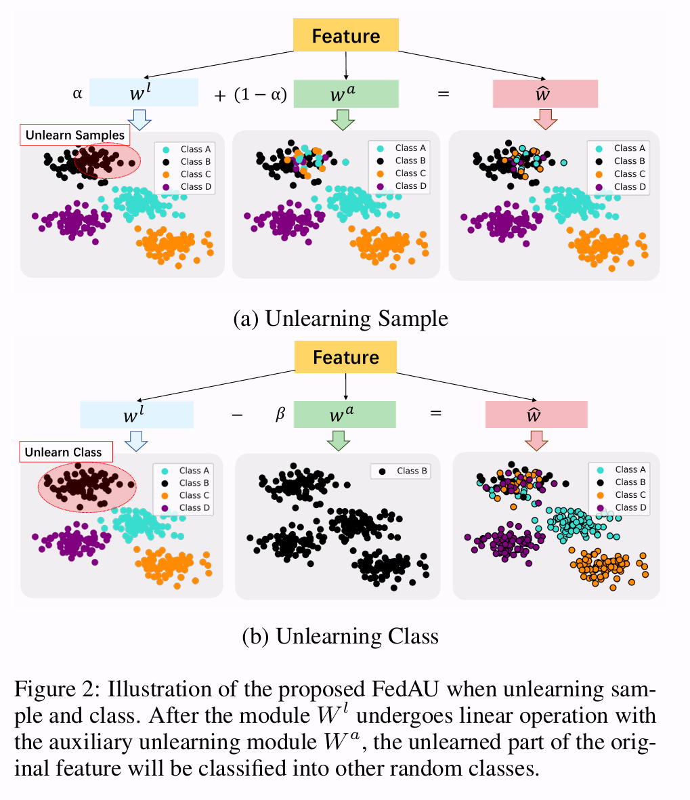
### Unlearning Sample in FL
首先考虑只有一个客户端 $k_0$ 试图遗忘一些样本 $D_{k_0}^u = \{(x_{k_0,i}^u, y_{k_0,i}^u)\}_{i=1}^m$ 的情景，核心步骤如下：
1. 客户端 $k_0$ 设计辅助数据集 $D_{k_0}^{\prime} = D_{k_0}^{\prime} \cup  D_{k_0}^{r^{\prime}}$ 。具体而言，$D_{k_0}^{\prime}$ 基于 $D_{k_0}^u$，通过将标签 $y_{k,i}^u$ 修改为 $y_{k,i}^{u'}   ∼ U(1, C)$ 来构建，其中 $D_{k_0}^{r^{\prime}} = D_{k_0}^{r}$，$U(1, C)$ 表示在值 $1，···，y_{k_0,i}^u − 1，y_{k_0,i}^u + 1，···，C$ 上的离散均匀分布（参见算法1蓝色第3-9行）。  
2. 然后，客户端 $k_0$ 在学习阶段根据 $D_{k_0}′$ 学习辅助遗忘模块 $W_{k_0}^a$（参见算法1绿色第10-15行）。  
3. 当客户端提出遗忘请求时，遗忘模型 $\tilde{W}$ 可表示为：  
$$
\tilde{W} = \alpha W^l + (1 − \alpha ) W_{k_0}^a
$$
> 其中 $\alpha$ 是一个小的正系数（参见算法1红色第21行）。

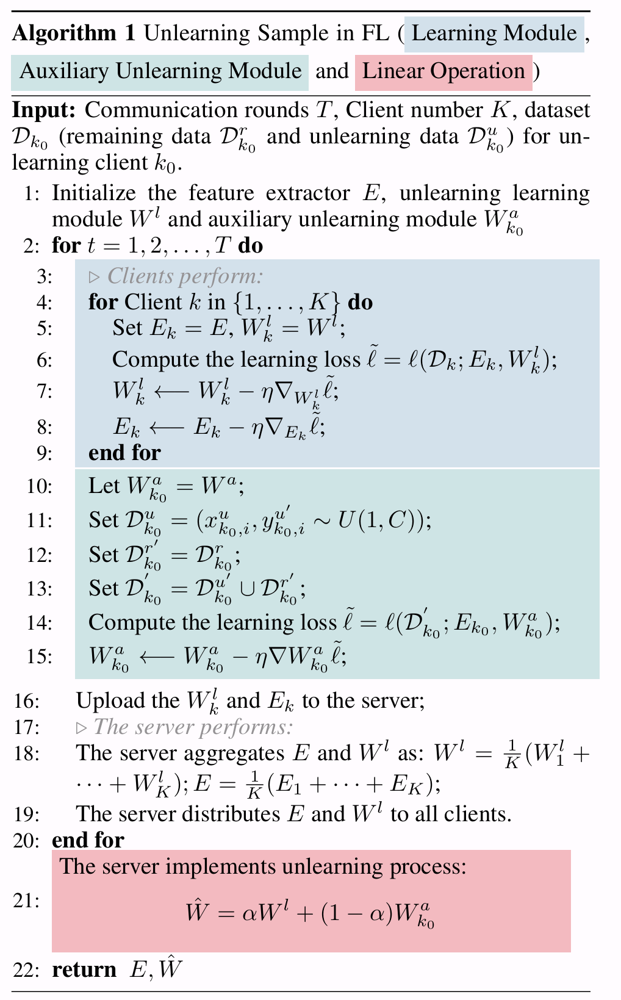

如图2(a)所示，剩余数据的类别不受加法操作的影响，因为剩余数据集和辅助数据集具有相同的类别。此外，当 $(1 − \alpha)$ 趋近于1时，遗忘数据类别主要受到辅助数据集的影响。

### Unlearning Class in FL
只有一个客户端  $k_0$ 试图遗忘类别 $c$ 的数据，记作 $D_{k_0}^u = \{(x_{k_0,i}^u , c)\}_{i=1}^m$ ，FedAU 包含以下三个步骤：
1. 客户端 $k_0$ 设计了辅助数据集 $D_{k_0}^′  = D_{k_0}^{u^\prime} \cup D_{k_0}^{r^′}$  。具体来说，$D_{k_0}^{r^′}$ 基于 $D_{k_0}^r$， 通过将标签$y_{k_0,i}^r$ 修改为标签 $c$ 而得 $D_{k_0}^{u^′} = D_{k_0}^u$ （见算法1中蓝色第3-9行）；  
• 然后客户端 $k_0$在学习阶段根据 $D_{k_0}^′$ 学习辅助遗忘模块 $W_{k_0}^a$ （算法1中绿色第10-15行）。  
• 最后，当提出遗忘请求时，遗忘模型 $\tilde{W}$ 可表示为：
$$
\tilde{W} = W^l - \beta W_{k_0}^a
$$
> 其中 $\beta$ 是一个较大的系数（见算法 2 的红线第 21 行）。

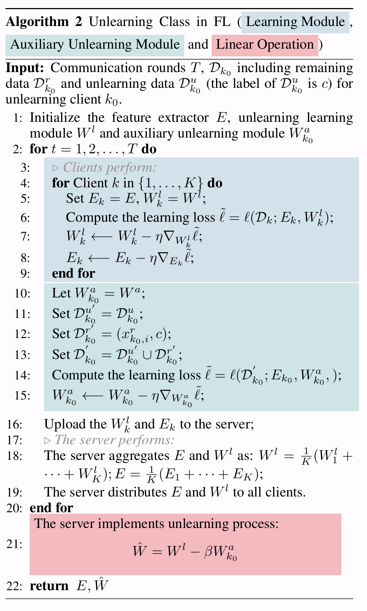

在图2(b)中，可以观察到减法操作不会影响剩余数据的类别。这是因为剩余数据集和辅助数据集具有不同的类别，从而导致被减数的类别得以保留。此外，遗忘数据和辅助数据具有相同的类别（由黑点表示），因此在执行减法时该类别可以被移除。

#### Unlearning Sample for Multiple Clients
对于多客户端遗忘样本情景，多个客户端 $C$ 协同学习 $W^a$，旨在优化：
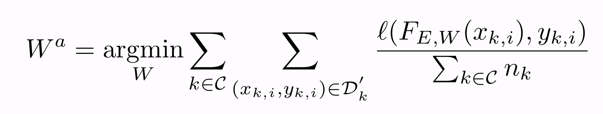

### Unlearning a Client in FL
忘记一个客户端（client）时可以看作遗忘样本（sample）的极端情况，能够利用用于遗忘样本的策略来遗忘客户端。关键的区别在于，在遗忘客户端 $k_0$ 的情况下，该客户没有剩余数据（$|D_{k_0}^r| = 0$）。因此，辅助忘记模块 $W_{k_0}^a$ 无法从其他客户端的数据中学习。为了解决这一问题，作者提出了一种改进的辅助忘记模块更新策略，该策略涉及在每个训练周期中结合从 $D-_{k_0}^{u^′}$ 和原始模型 $W^l$ 中学习的知识。
> 然后我并没有看到作者有写这部分的内容

### Unlearning for Multiple Clients
FedAU也可以应用于满足多个客户端的遗忘请求而不消耗额外时间。具体来说，对于遗忘类别，客户端集合 $C$ 中的每个客户端各自学习$W_k^a, k \in C$，目标是优化辅助遗忘模块。然后，所有客户获得遗忘模型 $\tilde{W}$，如下：
$$
\tilde{W} = W^l - \sum_{k \in C} \beta_k W_k^a
$$

在每一轮通信中，所有需要遗忘的客户端都会学习自己的辅助遗忘模块 $W_{k_0}^a$，如算法3的第10至17行所示。然后，他们将所有的 $W_{k_0}^a$ 上传到服务器进行汇总，如算法3的第18至20行所示。
最终，服务器得到遗忘学习模型 $\tilde{W}$（见算法3的23行）：
$$
\tilde{W} = \alpha W^l + (1 - \alpha) W^a
$$

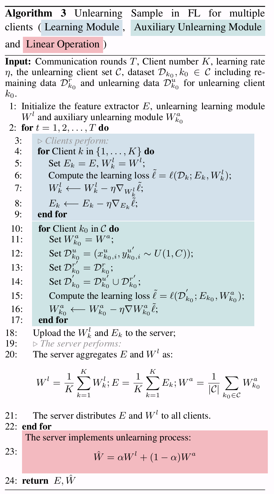

### Unlearning Class for Multiple Clients
对于多客户端 $C$ 同时遗忘类别，每个客户端各自学习辅助遗忘模块 $W_{k_0}^a$，其中$k_0 \in C$，该过程如算法4的第10至17行。随后，在遗忘步骤中，服务器通过以下方式获得遗忘模型 $\hat{W}$（见算法4第23行）：
$$
\hat{W} = W^l - \sum_{k_0 \in C} \beta_k W_{k_0}^a
$$

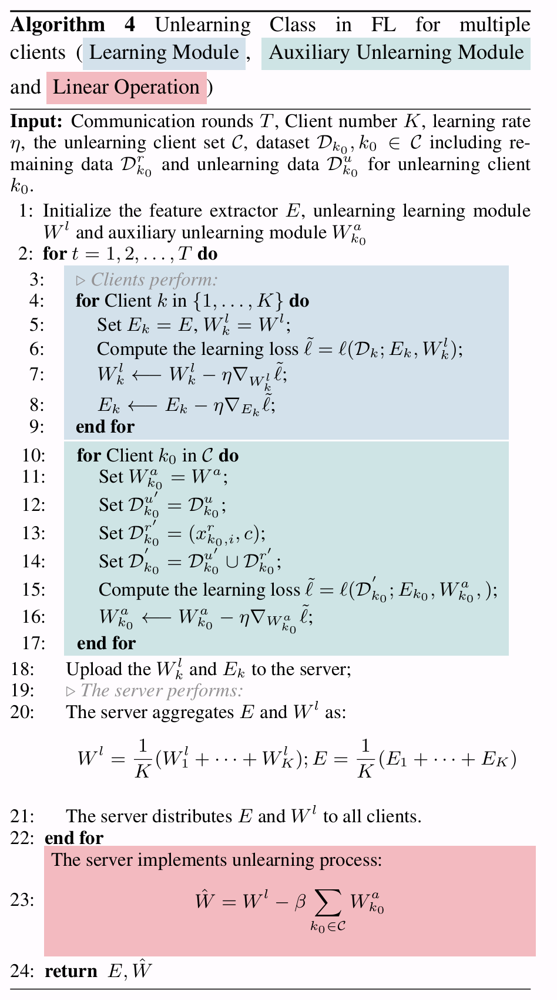

## 实验

论文使用三种数据集：
- MNIST
- CIFAR-10
- CIFAR-100

模型架构：
- LeNet 用于 MNIST
- AlexNet 用于 CIFAR-10
- ResNet18 用于 CIFAR-100

### 有效性评估
在表1中，作者通过测量剩余数据集的准确率来评估遗忘算法对剩余数据的有效性。

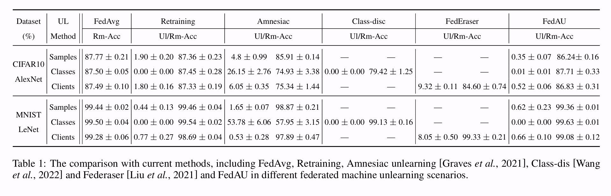

----------------------

### 遗忘开销
作者比较了每种联邦遗忘方法所消耗的时间，以展示相关的时间成本。在CIFAR10数据集上的主要结果呈现在表2中。根据这些结果，可以得出两个结论：
1. 在所有方案中，重新训练方案和包含微调操作的方案相比其他方法耗费的时间明显更多；
2. 虽然 Amnesiac 和 FedRecovery 方案在遗忘方面所需的时间相对较短，但它们仍然比FedAU慢几个数量级；
3. FedAU 导致的额外训练时间极少，例如，AlexNet-CIFAR10 仅额外增加 2 秒。这是因为 AU 模块轻量级，训练 AU 一次耗时很少，且成功训练 AU 仅需几个周期。
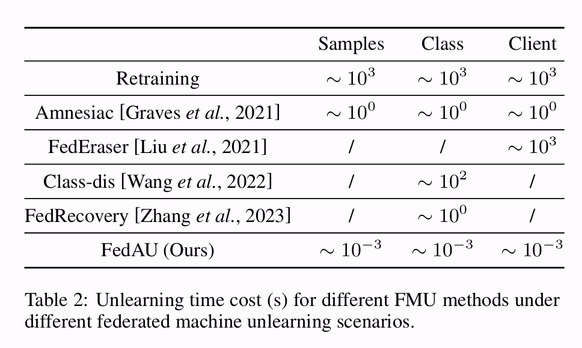

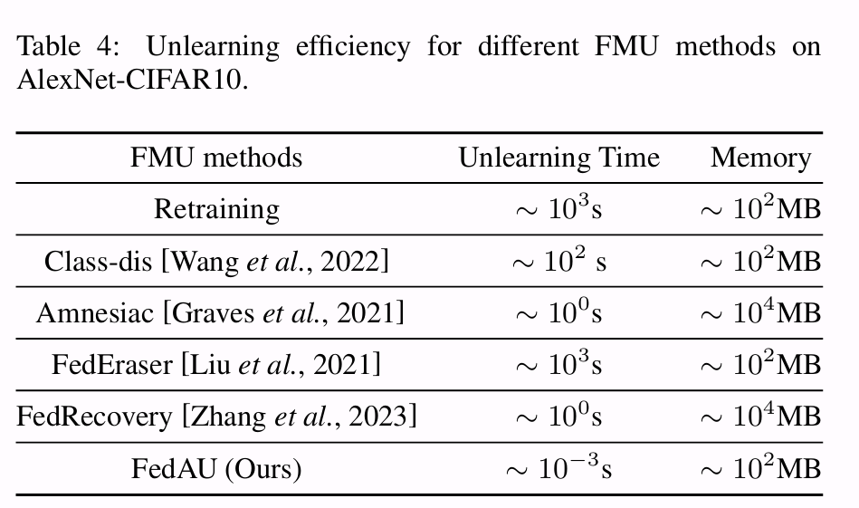

------------------------

### 训练开销
根据表5中呈现的实验结果，可以明显看出，Ul-Acc（遗忘准确率）在10个训练周期内降至2%以下。这表明辅助遗忘模块能够在相对较少的训练周期内有效学习。因此，无需辅助遗忘模块进行长时间训练。

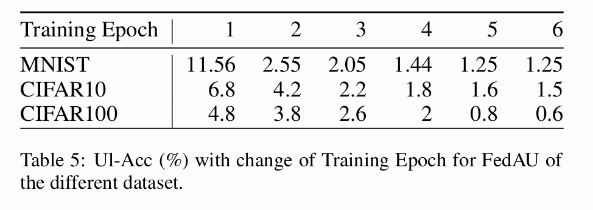

---------------------------------------

### MIA（成员推理攻击）成功率

表6中的实验结果比较了在CIFAR10遗忘类别场景下不同FMU方法的表现。结果显示FedAU的表现与重新训练方法相当，即FedAU的MIA攻击准确率为零。

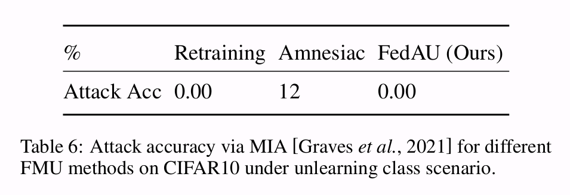

-----------------
### 对比 FedRecovery
作者在表7中将 FedAU 与FedRecovery 在遗忘某一客户端的场景下进行了比较。结果显示，FedAU的Ul-Acc更低且RmAcc更高，性能优于Fed。

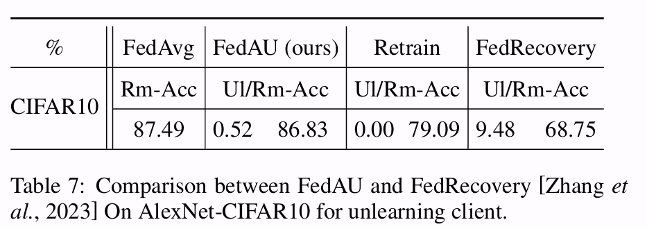

--------------

### 不同FMU方法在CIFAR-100上的比较

作者在表8中比较了不同的FMU方法在CIFAR-100上的表现。结果显示，FedAU在CIFAR-100中的样本、类别和客户端遗忘任务上也表现良好。具体而言，与重新训练和FedAvg相比，Ul-Acc和Rm-Acc的下降幅度仅低于3%和0.5%。

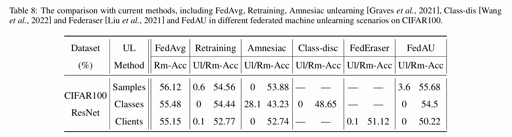

-----------

### 系数α和β的分析

作者提供了随着 α 和 β 变化时对遗忘数据和保留数据准确率的分析。结果如图 5 所示。

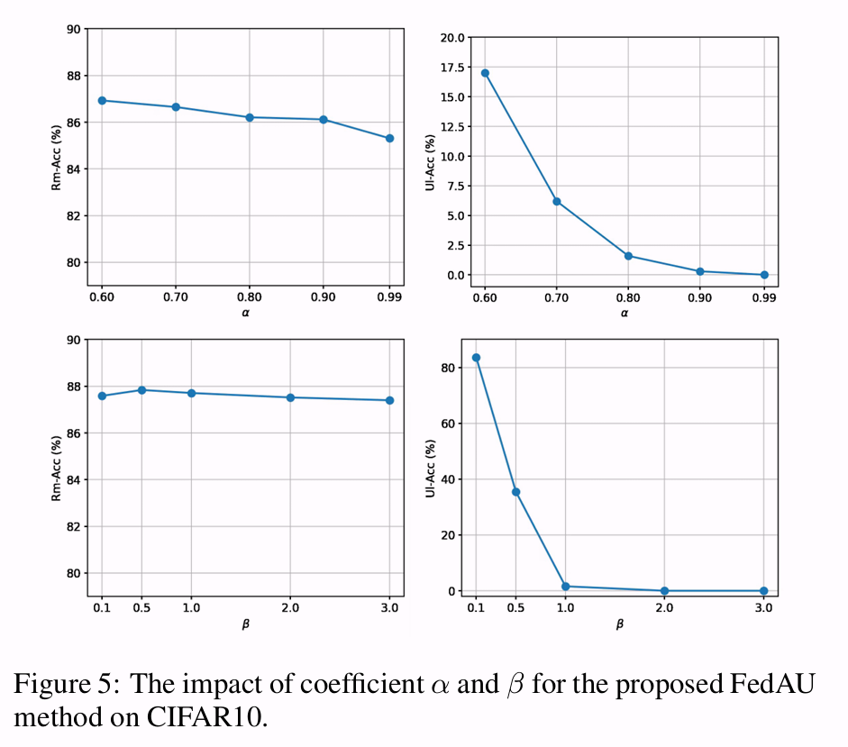

------------

### 遗忘样本比例分析
作者设置了遗忘客户端总共拥有5000个训练数据，图6的结果表明，随着遗忘学习样本比例的增加，Ul-Acc变得更高，而RmAcc则降低。

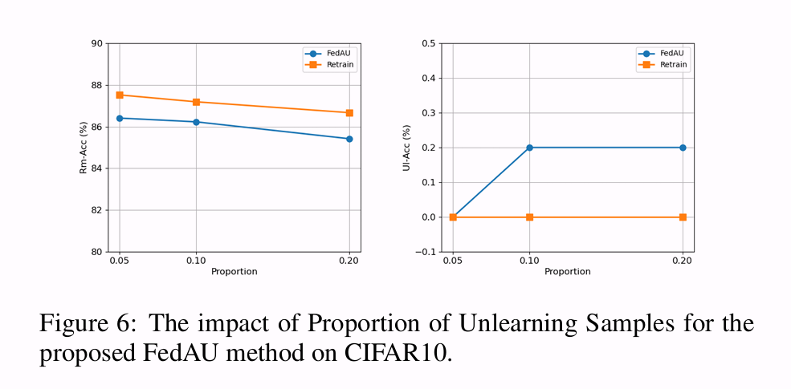