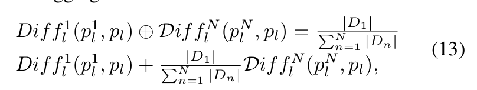

## 论文来源

| 名称  | [Unlearning through knowledge overwriting: Reversible federated unlearning via selective sparse adapter](https://cvpr.thecvf.com/virtual/2025/poster/35107) |
| --- | ------------------------------------------------------------------ |
| 期刊  | [CVPR 2025](https://cvpr.thecvf.com/virtual/2025/poster/35107)       |
| 作者  | Zhengyi Zhong, Weidong Bao, Ji Wang*, Shuai Zhang, Jingxuan Zhou, Lingjuan Lyu, Wei Yang Bryan Lim   |   
| DOI  | https://doi.org/10.48550/arXiv.2502.20709      |   

## TDLR
该研究提出的FUSED方法，通过创新性地结合 **关键层识别**、 **稀疏适配器** 以及 **知识覆写策略** ，为联邦学习中的数据遗忘问题提供了一个颇具前景的解决方案。它在保证遗忘效果的同时，兼顾了低成本与 *可逆性* ，对于推动联邦学习在实际应用中的安全与可信发展具有重要参考价值。

## 背景
参与联邦学习训练的用户应该“有权利遗忘”；此外，恶意客户可能在训练过程中注入有害数据，可能会毒化全球模型。因此，全球模型必须消除这种有害知识。
现有的遗忘学习存在以下问题：
- **不可区分地遗忘**：在客户之间存在知识重叠的情况下，传统方法在遗忘过程中不加区分地删除共享知识，导致其他客户的性能大幅下降；
- **遗忘的知识不可逆**：客户端的遗忘请求可能会动态变化。当客户端不再需要遗忘某些知识时，传统方法无法快速恢复该记忆。；
- **遗忘开销大**：基于再训练的方法需要多次迭代，导致显著的计算和通信开销。即使是对模型参数的简单调整，也可能需要大量存储作为补偿成本。

## Preliminaries
### Critical Layer Identification (CLI) 关键层识别
在客户端将更新后的模型参数发送给服务器之后，服务器根据这$N$个模型参数与初始模型参数进行计算。

假设模型的层数为$L$，客户端的总数为$N$，用 $p_l^n$ 代表第$n$个客户端的第$l$层与初始模型的参数差异。

初始分布式全局模型表示为 $\mathcal{M}^r = \{p_1, p_2, ... , p_L\}$。

在客户端进行本地训练后，模型第 $l$ 层的变化可以表示为：

其中 $Diff_l^n(p_l^n , p_l)$ 表示第 $n$ 个客户端模型的第 $l$ 层与服务器分发的需遗忘的原始模型的第 $l$ 层之间的差异。

$Diff$ 就是曼哈顿距离：

$\oplus$ 的聚合方法如下：

其中 $|D_i|$ 表示客户端 $i$ 的数据量。

最终，$LS = \big[argmax_l  \{Diff_l\}, ... , argmin_l  \{Diff_l\}\big]$ 表示获得了不同模型层中的变化。第一个元素对应于对客户端知识变化**最敏感**的层索引，而最后一个元素对应于**最稳健**的层。为了最小化资源成本，后续的遗忘过程优先在最敏感的模型层中进行遗忘。

### Unlearning via sparse adapters 通过稀疏适配器实现遗忘

基于从CLI获得的列表，给定一个预设的需遗忘层数 $K$ ，$LS$中的前 $K$ 个索引被指定用于遗忘学习。

- 假定 $\mathcal{L}^f$ 代表要被**遗忘**的层，$\mathcal{L}^r$ 代表剩下的要被**冻结** （frozen）的层。

- 对于$\mathcal{L}^f$ 中的每个遗忘层，我们以随机方式丢弃大部分参数，仅保留一小部分（剩余非0元素），形成稀疏参数矩阵 $A^f$ 。

在训练过程中，仅训练 $A^f$，而 $\mathcal{L}^f$ 保持不变。
> $A^f$ 来自 $\mathcal{L}^f$ ，原文又说训练时只训练前者，而后者保持不变，不太懂。。。按照图例，应该是只传递 前者。

在推理过程中，遗忘层的新参数通过直接将 $A^f$（记作 $p_{A^f}$）和$\mathcal{L}^f$（记作 $p_{\mathcal{L}^f}$）的参数相加获得。

> 图中的 $\mathcal{L}^r$ 与$\mathcal{L}^f$ 标反了.

## 方法展开
----------------
- $\mathcal{M}^r$ 表示遗忘前的模型；
- $\mathcal{M}^f$ 表示遗忘后的模型；
- $\mathcal{D}^u$ 表示要被遗忘的数据；
- $\mathcal{D}^r = \mathcal{D} \setminus \mathcal{D}^u$ 表示用于重训练的数据；
-----------------------

在遗忘阶段：
对于 **原始模型 $\mathcal{M}^r$** ，整个遗忘过程可以分为四个阶段：**模型分发**、**本地训练**、**模型上传**和**模型聚合**。

### 模型分发
模型仅分发给包含记忆数据集 $D^r$（没有发出遗忘请求）的客户端，且仅传输遗忘适配器 $A^f$，这大大降低了通信开销。

### 本地训练
对于客户端 $n$，假设每次联邦迭代的本地训练总轮数为 $E$，则在第 $t$ 次联邦迭代中，模型 $M_n(i, e)$ 的参数为    $(p_{A_n^f(i,e)} + p_{\mathcal{L}^f} ) \circ \ p_{\mathcal{L}^r}$ 。训练过程如下：

其中 $e = 0，... , E − 1，F_n(D_n^r, M_n(i, e))$ 表示损失，$\eta$ 表示学习率。

- 在每一轮本地训练中，$\mathcal{M}_n(i, e)$ 是由原始模型 $\mathcal{M}^r$ 与上一轮获得的稀疏矩阵 $A_n^f(i,e)$ 融合得出的。
- 每完成一轮训练便对应一个**知识覆盖**的过程，在此过程中剩余的知识会逐步增强。值得注意的是，在训练过程中，**仅更新 $p_{A_n^f(i,e)}$ **。
- 其他参数 **$p_{\mathcal{L}^f}$ 和 $p_{\mathcal{L}^r}$ 保持冻结**，仅用于推理期间计算损失。

### 模型上传
客户端 $n$ 将 $A_f^n$ 上传。

### 模型聚合
服务器将收集到的适配器进行平均聚合。

## 伪代码

## 实验
### Diff值
比较ResNet18和Transformer不同层不同迭代轮数下的Diff值

图2: 不同模型中本地模型与服务器模型的平均差异

> ?Resnet18为什么有60层？？？？？？？

### 遗忘能力
定义三个指标：
- RA：剩余数据集上的测试准确率，应尽可能高以最小化知识干扰。
- FA：遗忘学习数据集上的测试准确率，应该可能低。
- ReA：重新学习的准确性，指的是在指定次数的迭代后重新学习遗忘知识所能达到的准确性。如果遗忘知识被有效地擦除，则在随后的重学过程中达到的准确性将较低。
- MIA：遗忘后的隐私泄露率，在成员推断攻击的背景下进行评估。假设被遗忘的数据是私密的，攻击模型较低的推断准确率表明隐私泄露较少。

从表1可以观察到，在直接衡量遗忘效果的三个指标——RA、FA和ReA中，只有FUSED接近于重新训练（Rrtraining）。该方法在遗忘数据上保持较低的准确率，同时在其他数据上达到较高的准确率，甚至在Transformer模型中表现出整体优于重新训练的效果。
- Comp 是完成预定遗忘迭代所需的时间；
- Comm 表示单个客户端与服务器之间传输的数据量。

表1. 主要结果。“0A”代表第0类的准确率，“PS”指预测的第0类的精确度。符号↑表示数值越高越好，符号↓表示相反E-F”是Exact-Fun的简称，“E-C”是EraseClient的简称。
因为FUSED并没有擦除遗忘数据的参数，所以MIA值高是正常的。

### 对重叠知识的遗忘
表2可以观察到，所有方法都会完全遗忘遗忘客户特有的知识，而只有FUSED方法在重训练的基础上表现出对重叠知识的性能提升。因此，FUSED能够减少知识干扰。

表2。“F-Acc”表示卸载客户端独有知识的准确率，“C-Acc”表示重叠知识的准确率，“R-Acc”表示剩余独有知识的准确率。

## 总结
这篇论文通过使用CLI技术，计算每个客户端的每一层关于自身数据的敏感性，当客户端发出遗忘请求时，服务器会按照LS里面的索引选取前K大的层，然后从这些层中随机选一小部分值组成稀疏矩阵A，然后只迭代训练A，通过将A与原来的遗忘层的元素进行累加，来一步步实现知识覆写。

