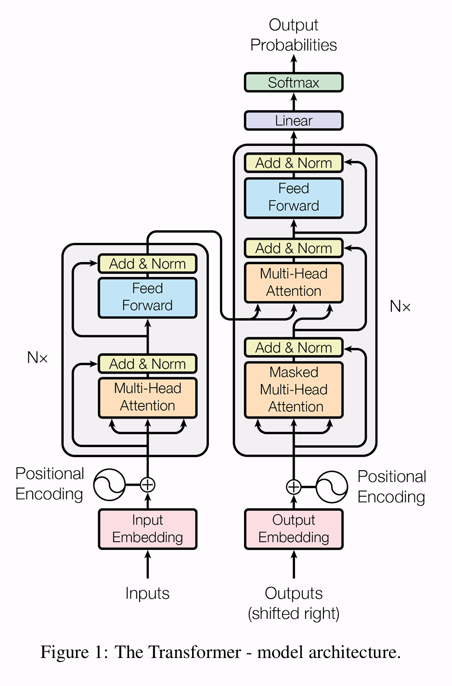

# Attention Is All You Need

## 论文来源
|名称 |	Attention Is All You Need|
|-|-|
| 会议| [NeurIPS 2017](https://proceedings.neurips.cc/paper/2017/hash/3f5ee243547dee91fbd053c1c4a845aa-Abstract.html)|
| 作者 |Ashish Vaswani, Ashish Vaswani, Ashish Vaswani, Jakob Uszkoreit, Jakob Uszkoreit, Aidan N. Gomez, Łukasz Kaiser, Illia Polosukhin |
|DOI |	[DOI: 10.1109/TDSC.2024.3354736](https://doi.org/10.48550/arXiv.1706.03762)|

> 提供本文的全文翻译

## Abstract
显性序列转导模型基于复杂的递归或卷积神经网络，包括编码器和解码器。性能最好的模型还通过注意机制连接编码器和解码器。我们提出了一种新的简单网络架构，Transformer，仅基于注意机制，在两个机器翻译任务上的实验表明，这些模型在质量上是上级的，同时具有更好的并行性，并且需要的时间大大减少。训练时间。我们的模型在WMT 2014英语到德语翻译任务中获得了28.4 BLEU，比现有的最佳结果（包括集成）提高了2 BLEU以上。在WMT 2014英语到法语翻译任务中，我们的模型在8个GPU上训练了3.5天后，建立了一个新的单模型最先进的BLEU得分41.0，文献中最好的模型的一小部分训练成本。

## 1. Introduction
递归神经网络，特别是长短时记忆（long short-term memory）[12]和门控递归（gated recurrent）[7]神经网络，已被牢固地确立为序列建模和转换问题（如语言建模和机器翻译）中的最新方法[29，2，5]。此后，人们继续进行了大量努力，以推动递归语言模型和编码器-解码器（encoder-decoder）架构的边界[31，21，13]。

递归模型(Recurrent models)通常将计算沿着输入和输出序列的符号位置进行分解。将位置与计算时间中的步骤对齐，它们生成隐藏状态 $h_t$ 的序列，作为先前隐藏状态 $h_{t-1}$ 和位置 $t$ 的输入的函数。这种固有的顺序性质排除了训练示例中的并行化，这在较长的序列长度下变得至关重要，由于内存限制限制了跨示例的并行计算。最近的工作通过因式分解技巧[18]和条件计算[26]实现了计算效率的显着提高，同时也提高了后者的模型性能。然而，顺序计算的基本约束仍然存在。

注意力机制（Attention mechanisms）已经成为各种任务中强制序列建模和转导模型的组成部分，允许对依赖关系进行建模，而无需考虑它们在输入或输出序列中的距离[2，16]。然而，在除少数情况外的所有情况下[22]，这种注意力机制都与递归网络结合使用。

在这项工作中，我们提出了Transformer，一个模型架构避免复发，而是完全依赖于注意力机制，以绘制输入和输出之间的全局依赖关系。

Transformer支持更高的并行化，在8个P100 GPU上训练12小时后，翻译质量就能达到最新水平。

## 2. Background
减少顺序计算的目标也构成了扩展神经（Extended Neural）GPU [20]，ByteNet [15]和ConvS2S [8]的基础，所有这些都使用卷积神经网络（CNN）作为基本构建块，并行计算所有输入和输出位置的隐藏表示。在这些模型中，使来自两个任意输入或输出位置的信号相关所需的操作数量随着位置之间的距离而增长，线性地用于ConvS2S，而数学地用于ByteNet。这使得学习远距离位置之间的依赖关系变得更加困难[11]。在 Transformer 中，这被减少到恒定数量的操作，尽管由于平均注意力加权位置而降低了有效分辨率，我们用3.2节中描述的多头注意力抵消这种影响。

自注意（Self-attention），有时也称为内注意（intra-attention），是一种将单个序列的不同位置联系起来以计算序列表征的注意机制。自注意已成功用于各种任务，包括阅读理解、抽象概括、文本蕴涵和学习任务无关的句子表征[4，22，23，19]。

端到端记忆网络（End-to-end memory networks）基于循环注意机制而不是序列对齐的循环，并且已被证明在简单语言问题回答和语言建模任务中表现良好[28]。

然而，据我们所知，Transformer 是第一个完全依靠自注意力来计算其输入和输出的表示而不使用序列对齐的 RNN 或卷积的转换模型。在下面的部分中，我们将描述 Transformer，激发自注意力，并讨论其相对于[14，15]和[8]等模型的优势。

##  3. Model Architecture
大多数竞争性神经序列转导模型具有编码器-解码器结构[5，2，29]。

在这里，编码器将输入的符号表示序列 $(x_1,... x_n)$ 映射到连续表示序列 $\mathbf{z} =(z_1,...,z_n)$。给定 $\mathbf{z}$ ，解码器然后生成一个符号的输出序列 $(y_1,...,y_m)$，一次一个元素。在每一步，模型都是自回归的[9]，在生成下一个符号时，消耗先前生成的符号作为额外的输入。

Transformer 遵循这种整体架构，编码器和解码器均使用堆叠的自注意和逐点全连接层，分别如图1的左半部分和右半部分所示。

> 
图1：Transformer模型体系结构。

### 3.1 Encoder and Decoder Stacks 编码器和解码器堆栈
**编码器**：编码器由 $N = 6$ 个相同层的堆栈组成。每个层有两个子层。
- 第一个是多头自注意机制，
- 第二个是一个简单的位置全连接前馈网络。

我们在两个子层中的每一个周围使用残差连接[10]，然后进行层归一化[1]。也就是说，每个子层的输出是 $LayerNorm(x + Sublayer(x))$ ，其中 $Sublayer(x)$ 是由子层本身实现的函数。为了便于这些残差连接，模型中的所有子层以及嵌入层产生维度 $d_{model} = 512$ 的输出。

**解码器**：解码器也由 $N = 6$ 个相同层的堆栈组成。除了每个编码器层中的两个子层之外，解码器还插入第三个子层，其对编码器堆栈的输出执行多头注意。与编码器类似，我们在每个子层周围使用残差连接，然后进行层归一化。我们还修改了解码器堆栈中的自注意子层，以防止位置关注后续位置。这种掩蔽，结合输出嵌入偏移一个位置的事实，确保位置 $i$ 的预测可以仅取决于小于 $i$ 的位置处的已知输出。

### 3.2 Attention 注意力
注意力函数可以被描述为将查询（query）和一组键值对（key-value pairs）映射到输出（output），其中查询、键、值和输出都是向量（vectors）。输出被计算为值的加权和（weighted sum），其中分配给每个值的权重由查询与对应键的兼容性函数计算。

> 
图2：（左）缩放点积注意力。（右）多头注意力由多个并行运行的注意力层组成。

#### 3.2.1 Scaled Dot-Product Attention 缩放点积注意力

我们将我们的注意力称为“Scaled Dot-Product Attention”（图2）。输入由查询和维度为 $d_k$ 的键以及维度为 $d_v$ 的值组成。我们计算查询与所有键的点积（dot products），将每个键除以 $\sqrt{d_k}$ ，然后应用 $softmax$ 函数来获得值的权重。

在实践中，我们同时计算一组查询的注意力函数，将它们打包成矩阵 $Q$ 。键和值也打包成矩阵 $K$ 和 $V$ 。我们计算输出矩阵为：
$$
Attention(Q, K, V) = softmax(\frac{QK^T}{\sqrt{d_k}})V
$$

两个最常用的注意力函数是加法注意力[2]和点积（乘法）注意力。点积注意力与我们的算法相同，除了比例因子为 $\frac{1}{\sqrt{d_k}}$ 。加法注意力使用具有单个隐藏层的前馈网络计算兼容性函数。虽然两者在理论复杂度上相似，实际上，点积注意力更快并且更节省空间，因为它可以使用高度优化的矩阵乘法代码来实现。

当 $d_k$ 值较小时，这两种机制的表现相似，对于较大的 $d_k$ 值，加法注意力优于点积注意力，而不进行缩放[3]。我们怀疑，对于较大的 $d_k$ 值，点积在幅度上变大，将 $softmax$ 函数推入梯度极小的区域。为了抵消这种影响，我们将点积缩放 $\frac{1}{\sqrt{d_k}}$ 。

#### 3.2.2 Multi-Head Attention 多头注意力
我们发现，不是对 $d_{model}$-维的键、值和查询执行单个注意力函数，而是将查询、键和值分别线性投影 $h$ 次到 $d_k$ 、$d_k$ 和 $d_v$ 维，这是有益的。然后，在查询、键和值的每个投影版本上，我们并行执行注意力函数，这些被连接并再次投影，产生最终值，如图2所示。

多头注意力允许模型在不同位置共同关注来自不同表示子空间的信息，而对于单个注意力，平均化则抑制了这一点。

$$
MultiHead(Q,K,V)=Concat(head_1,...,head_h)W^O
$$

$$
head_i=Attention(QW_i^Q,KW_i^K,VW_i^V)
$$
其中投影是参数矩阵 $W_i^Q \in \mathbb{R}^{d_model} \times d_k$ 、 $W_i^K \in \mathbb{R}^{d_{model}\times d_v}$ 和 $W^O \in \mathbb{R}^{hd_v\times d_{model}}$ 。

在这项工作中，我们采用了 $h = 8$ 个平行的注意力层，或头部。对于每个注意力层，我们使用 $d_k = d_v = d_{model}/h = 64$ 。由于每个头部的维数减少，总的计算成本与全维数的单头注意力相似。
#### 3.2.3 Applications of Attention in our Model 注意力在模型中的应用
Transformer 以三种不同的方式使用多头注意力：
- 在“编码器-解码器注意（encoder-decoder attention）”层中，查询来自前一个解码器层，而存储器键和值来自编码器的输出。这允许解码器中的每个位置都注意输入序列中的所有位置。这模仿了序列到序列模型中的典型编码器-解码器注意机制，例如[31，2，8]的情况。
- 编码器包含自注意层。在自注意层中，所有的键、值和查询都来自同一个位置，在这种情况下，是编码器中上一层的输出。编码器中的每个位置都可以关注编码器中上一层的所有位置。
- 同样，在解码器中的自注意层允许解码器中的每个位置注意到解码器中直到并包括该位置的所有位置。我们需要防止在解码器中的向左信息流以保持自回归特性。我们通过掩蔽来实现缩放的点积注意的内部（设置为 $-\infty$ ）$softmax$ 的输入中对应于非法连接的所有值。参见图2。

### 3.3 Position-wise Feed-Forward Networks 位置前馈网络
除了注意力子层之外，我们的编码器和解码器中的每个层都包含一个完全连接的前馈网络，该网络分别相同地应用于每个位置。这包括两个线性变换，中间有一个ReLU激活。
$$
FFN(x)=max(0, xW_1+b_1)W_2+b_2
$$
虽然不同位置的线性变换是相同的，但它们在层与层之间使用不同的参数。另一种描述这种情况的方法是两个卷积，内核大小为 $1$ 。输入和输出的维度为 $d_{model} = 512$ ，内层的维度为 $d_{ff} = 2048$ 。

### 3.4 Embeddings and Softmax 嵌入和Softmax
与其他序列转换模型类似，我们使用学习的嵌入将输入令牌和输出令牌转换为维度 $d_{model}$ 的向量。我们还使用通常的学习线性变换和 $softmax$ 函数将解码器输出转换为预测的下一个令牌概率。在我们的模型中，我们在两个嵌入层和预softmax (pre-softmax) 线性变换之间共享相同的权重矩阵，类似于[24]。在嵌入层中，我们将这些权重乘以 $\sqrt{d_{model}}$ 。

### 3.5 Positional Encoding 位置编码
由于我们的模型不包含递归和卷积，为了让模型利用序列的顺序，我们必须注入一些关于序列中令牌的相对或绝对位置的信息。为此，我们在编码器和解码器堆栈的底部向输入嵌入添加“位置编码”。位置编码与嵌入具有相同的维度 $d_{model}$ ，这样两者就可以相加。位置编码有很多选择，有学习（learned）的，也有固定的（fixed）[8]。

在这项工作中，我们使用不同频率的正弦和余弦函数：
$$
PE_{(pos,2i)}=sin(pos/10000^{2i/d_{model}})
$$

$$
PE_{(pos,2i+1)}=cos(pos/10000^{2i/d_{model}})
$$
其中 $pos$ 是位置，$i$ 是维度。也就是说，位置编码的每个维度都对应于正弦曲线。波长形成从 $2\pi$ 到 $10000 \cdot 2\pi$的几何级数。我们选择这个函数是因为我们假设它可以让模型很容易地学习通过相对位置来参与，因为对于任何固定的偏移量 $k$，$PE_{pos+k}$ 可以表示为 $PE_{pos}$ 的线性函数。

我们还尝试使用学习的位置嵌入[8]，发现两个版本产生几乎相同的结果（见表3行（E））。我们选择正弦版本，因为它可以允许模型外推到比训练期间遇到的更长的序列长度。

## 4. Why Self-Attention 为什么自注意力
在本章中，我们将自注意力层的各个方面与常用于映射一个可变长度符号表示序列的递归层和卷积层进行比较 $(x_1,...,x_n)$ 到另一个长度相等的序列 $(z_1,...,z_n)$ ，其中 $x_i, z_i \in \mathbb{R}^{d}$ ，例如典型序列转换编码器或解码器中的隐藏层。

一个是每层的总计算复杂度，另一个是可以并行化的计算量，即所需的最小顺序操作数。

第三个是网络中长程依赖之间的路径长度。学习长程依赖是许多序列转换任务中的关键挑战。影响学习此类依赖能力的一个关键因素是前向和后向信号必须在网络中遍历的路径长度。输入和输出序列中任何位置组合之间的路径越短，学习远程依赖关系就越容易[11]。因此，我们还比较了由不同层类型组成的网络中任意两个输入和输出位置之间的最大路径长度。

> 表1：最大路径长度，每层复杂度和不同层类型的最小顺序操作数量。$n$ 是序列长度，$d$ 是表示维数，$k$ 是卷积的核大小，$r$ 是限制自注意中邻域的大小。

如表1所示，自注意层用恒定数量的顺序执行的操作连接所有位置，而递归层需要 $O(n)$ 个顺序操作。就计算复杂度而言，当序列长度 $n$ 小于表示维数 $d$ 时，自注意层比递归层快，最常见的情况是机器翻译中最先进的模型所使用的句子表示，例如单词段[31]和字节对[25]表示。为了提高涉及非常长序列的任务的计算性能，自注意可以被限制为只考虑输入序列中以相应输出位置为中心的大小为 $r$ 的邻域。这将使最大路径长度增加到 $O(n/r)$ 。我们计划在未来的工作中进一步研究这种方法.

一个内核宽度 $k < n$ 的单个卷积层不会连接所有的输入和输出位置对。这样做需要一个 $O(n/k)$ 卷积层的堆栈在连续内核的情况下，或者 $O(log_k(n))$ 在扩张卷积的情况下[15]，增加网络中任何两个位置之间的最长路径的长度。卷积层通常比递归层更昂贵，然而，可分离卷积[6]大大降低了复杂度，达到 $O(k \cdot n \cdpt d + n \cdot d^2)$ 。然而，即使 $k = n$ ，可分离卷积的复杂度也等于自注意层和逐点前馈层的组合，我们在模型中采用的方法。

作为附带的好处，自我注意力可以产生更多的可解释的模型。我们从我们的模型中检查注意力分布，并在附录中展示和讨论示例。不仅单个注意力头清楚地学习执行不同的任务，许多注意力头似乎表现出与句子的句法和语义结构相关的行为。

## 5 Training 训练
本章描述我们模型的训练制度。
### 5.1 Training Data and Batching 训练数据和批处理
我们在标准 *WMT 2014英语-德语* 数据集上进行了训练，该数据集由大约450万个句子对组成。句子使用字节对编码[3]进行编码，该编码具有大约37000个标记的共享源目标词汇。对于英语-法语，我们使用了更大的 *WMT 2014英语-法语* 数据集，包括3600万个句子，并将标记拆分为32000个词块词汇[31]。每个训练批次包含一组句子对，这些句子对包含大约25000个源标记和25000个目标标记。

### 5.2 Hardware and Schedule 硬件和时间表
我们在一台配有8个NVIDIA P100 GPU的机器上训练我们的模型。对于使用本文中描述的超参数的基础模型，每个训练步骤大约需要0.4秒。我们总共训练了100，000步或12小时。对于我们的大模型，（在表3的底线上描述），步骤时间为1.0秒。

### 5.3 Optimizer 优化器
我们使用 Adam优化器[17]，$\beta_1 = 0.9, \beta_2 = 0.98$ 和 $\epsilon= 10^{−9}$ 。我们根据公式在训练过程中改变学习率：
$$
lrate = d_{model}^{-0.5} \cdot min(step_num^{-0.5}, step_num \cdot warmup_steps^{-1.5})
$$
这对应于在第一个 $warmup_steps$ 训练步骤中线性增加学习速率，然后按步骤数的平方根倒数成比例地降低学习速率。我们使用 $warmup_steps = 4000$ 。

### 5.4 Regularization 正则化
我们在训练过程中使用了三种类型的正则化：

**残差丢弃** 我们将 *dropout* [27]应用于每个子层的输出，然后将其添加到子层输入并归一化。此外，我们将 dropout 应用于编码器和解码器堆栈中的嵌入和位置编码的总和。对于基础模型，我们使用 $P_{drop} = 0.1$ 的速率。

**标签平滑** 在训练过程中，我们使用了 $ls = 0.1$ 的标签平滑[30]。这会伤害困惑（perplexity），因为模型学习到更不确定，但提高了准确性和BLEU分数。

## 6 Results 结果

### 6.1 Machine Translation 机器翻译

> 表2：Transformer在2014年最新的英语转德语和英语转法语测试中取得了比以前最先进的机型更好的BLEU分数，而培训成本仅为前者的一小部分。

在 WMT 2014英语到德语 的翻译任务中，大型Transformer模型（表2中的Transformer（大））的BLEU比之前报道的最佳模型（包括集成）高出2：0以上，建立了最先进的BLEU分数28.4 。该模型的配置列于表3的底部行。在8个P100 GPU上的训练时间为3.5天。即使是我们的基础模型也超过了之前发布的所有模型和集成，而训练成本只是任何竞争模型的一小部分。

在 WMT 2014英语到法语 的翻译任务中，我们的大模型的BLEU得分达到41.0，优于之前发布的所有单个模型，而训练成本不到之前最先进模型的 $1/4$ 。针对英语到法语的训练的Transformer（大）模型使用的丢弃率 $P_{drop} = 0.1$ ，而不是 $0.3$ 。

对于基础模型，我们使用通过平均最后5个检查点获得的单个模型，这些检查点以10分钟的间隔写入。对于大模型，我们平均最后20个检查点。我们使用波束搜索，波束大小为4，长度惩罚 $\alpha = 0.6$ [31]。这些超参数是在开发集上进行实验后选择的。我们将推断期间的最大输出长度设置为输入长度+ 50，但尽可能提前终止[31]。

表2总结了我们的结果，并将我们的翻译质量和训练成本与文献中的其他模型架构进行了比较。我们通过乘以训练时间、使用的 GPU 数量以及每个 GPU 的持续单精度浮点容量估计值来估计用于训练模型的浮点运算数量。

### 6.2 Model Variations 型号变化

> 表3：Transformer架构的变体。未列出的值与基本模型的值相同。所有指标都在英德翻译开发集newest2013上。根据我们的字节对编码，列出的困惑度是每个单词的，不应与每个单词的困惑度进行比较。

为了评估Transformer的不同组件的重要性，我们以不同的方式改变了我们的基础模型，测量了开发集newstest2013上英语到德语翻译的性能变化。我们使用了前一节所述的波束搜索，但没有检查点平均。我们在表3中列出了这些结果。

在表3的（A）行中，我们改变了注意力头部的数量以及注意力键和值维度，保持计算量不变，如第3.2.2节所述。虽然单头注意力比最佳设置差 0.9 BLEU，但质量也会随着头部太多而下降。

在表3（B）行中，我们观察到减小注意力键大小dk会损害模型质量。这表明确定兼容性并不容易，并且比点积更复杂的兼容性函数可能是有益的。我们进一步在（C）行和（D）中观察到，正如预期的那样，更大的模型更好，在（E）行中，我们用学习到的位置嵌入[8]替换正弦位置编码，并观察到与基本模型几乎相同的结果。

## 7. Conclusion 结论
在这项工作中，我们提出了Transformer，这是第一个完全基于注意力的序列转换模型，用多头自注意力取代了编码器-解码器架构中最常用的递归层。

对于翻译任务，Transformer的训练速度明显快于基于递归层或卷积层的架构。在 WMT 2014英语到德语 和 WMT 2014英语到法语 翻译任务中，我们实现了最新的技术水平。在前一个任务中，我们最好的模型甚至优于所有先前报道的集成。

我们对基于注意力的模型的未来感到兴奋，并计划将其应用于其他任务。我们计划将Transformer扩展到涉及文本以外的输入和输出模态的问题，并研究局部的、受限制的注意力机制，以有效地处理图像、音频和视频等大输入和输出。

我们用来训练和评估模型的代码可以在 https://github.com/ tensorflow/tensor2tensor 上找到。

## References 参考文献

[1] Jimmy Lei Ba, Jamie Ryan Kiros, and Geoffrey E Hinton. Layer normalization. arXiv preprint arXiv:1607.06450, 2016.

[2] Dzmitry Bahdanau, Kyunghyun Cho, and Yoshua Bengio. Neural machine translation by jointly learning to align and translate. CoRR, abs/1409.0473, 2014.

[3] Denny Britz, Anna Goldie, Minh-Thang Luong, and Quoc V. Le. Massive exploration of neural machine translation architectures. CoRR, abs/1703.03906, 2017.

[4] Jianpeng Cheng, Li Dong, and Mirella Lapata. Long short-term memory-networks for machine reading. arXiv preprint arXiv:1601.06733, 2016.

[5] Kyunghyun Cho, Bart van Merrienboer, Caglar Gulcehre, Fethi Bougares, Holger Schwenk, and Yoshua Bengio. Learning phrase representations using rnn encoder-decoder for statistical machine translation. CoRR, abs/1406.1078, 2014.

[6] Francois Chollet. Xception: Deep learning with depthwise separable convolutions. arXiv preprint arXiv:1610.02357, 2016.

[7] Junyoung Chung, Çaglar Gülçehre, Kyunghyun Cho, and Yoshua Bengio. Empirical evaluation of gated recurrent neural networks on sequence modeling. CoRR, abs/1412.3555, 2014.

[8] Jonas Gehring, Michael Auli, David Grangier, Denis Yarats, and Yann N. Dauphin. Convolutional sequence to sequence learning. arXiv preprint  arXiv:1705.03122v2, 2017.

[9] Alex Graves. Generating sequences with recurrent neural networks. arXiv preprint arXiv:1308.0850, 2013.

[10] Kaiming He, Xiangyu Zhang, Shaoqing Ren, and Jian Sun. Deep residual learning for image recognition. In Proceedings of the IEEE Conference on Computer Vision and Pattern Recognition, pages 770–778, 2016.

[11] Sepp Hochreiter, Yoshua Bengio, Paolo Frasconi, and Jürgen Schmidhuber. Gradient flow in recurrent nets: the difficulty of learning long-term dependencies, 2001.

[12] Sepp Hochreiter and Jürgen Schmidhuber. Long short-term memory. Neural computation, 9(8):1735–1780, 1997.

[13] Rafal Jozefowicz, Oriol Vinyals, Mike Schuster, Noam Shazeer, and Yonghui Wu. Exploring the limits of language modeling. arXiv preprint arXiv:1602.02410, 2016.

[14] Łukasz Kaiser and Ilya Sutskever. Neural GPUs learn algorithms. In International Conference on Learning Representations (ICLR), 2016.

[15] Nal Kalchbrenner, Lasse Espeholt, Karen Simonyan, Aaron van den Oord, Alex Graves, and Koray Kavukcuoglu. Neural machine translation in linear time. arXiv preprint arXiv:1610.10099v2, 2017.

[16] Yoon Kim, Carl Denton, Luong Hoang, and Alexander M. Rush. Structured attention networks. In International Conference on Learning Representations, 2017.

[17] Diederik Kingma and Jimmy Ba. Adam: A method for stochastic optimization. In ICLR, 2015.

[18] Oleksii Kuchaiev and Boris Ginsburg. Factorization tricks for LSTM networks. arXiv preprint arXiv:1703.10722, 2017.

[19] Zhouhan Lin, Minwei Feng, Cicero Nogueira dos Santos, Mo Yu, Bing Xiang, Bowen Zhou, and Yoshua Bengio. A structured self-attentive sentence embedding. arXiv preprint arXiv:1703.03130, 2017.

[20] Samy Bengio Łukasz Kaiser. Can active memory replace attention? In Advances in Neural Information Processing Systems, (NIPS), 2016.

[21] Minh-Thang Luong, Hieu Pham, and Christopher D Manning. Effective approaches to attentionbased neural machine translation. arXiv preprint arXiv:1508.04025, 2015.

[22] Ankur Parikh, Oscar Täckström, Dipanjan Das, and Jakob Uszkoreit. A decomposable attention model. In Empirical Methods in Natural Language Processing, 2016.

[23] Romain Paulus, Caiming Xiong, and Richard Socher. A deep reinforced model for abstractive summarization. arXiv preprint arXiv:1705.04304, 2017.

[24] Ofir Press and Lior Wolf. Using the output embedding to improve language models. arXiv preprint arXiv:1608.05859, 2016.

[25] Rico Sennrich, Barry Haddow, and Alexandra Birch. Neural machine translation of rare words with subword units. arXiv preprint arXiv:1508.07909, 2015.

[26] Noam Shazeer, Azalia Mirhoseini, Krzysztof Maziarz, Andy Davis, Quoc Le, Geoffrey Hinton, and Jeff Dean. Outrageously large neural networks: The sparsely-gated mixture-of-experts
layer. arXiv preprint arXiv:1701.06538, 2017.

[27] Nitish Srivastava, Geoffrey E Hinton, Alex Krizhevsky, Ilya Sutskever, and Ruslan Salakhutdinov. Dropout: a simple way to prevent neural networks from overfitting. Journal of Machine Learning Research, 15(1):1929–1958, 2014.

[28] Sainbayar Sukhbaatar, arthur szlam, Jason Weston, and Rob Fergus. End-to-end memory networks. In C. Cortes, N. D. Lawrence, D. D. Lee, M. Sugiyama, and R. Garnett, editors, Advances in Neural Information Processing Systems 28, pages 2440–2448. Curran Associates, Inc., 2015.

[29] Ilya Sutskever, Oriol Vinyals, and Quoc VV Le. Sequence to sequence learning with neural networks. In Advances in Neural Information Processing Systems, pages 3104–3112, 2014.

[30] Christian Szegedy, Vincent Vanhoucke, Sergey Ioffe, Jonathon Shlens, and Zbigniew Wojna. Rethinking the inception architecture for computer vision. CoRR, abs/1512.00567, 2015.

[31] Yonghui Wu, Mike Schuster, Zhifeng Chen, Quoc V Le, Mohammad Norouzi, Wolfgang Macherey, Maxim Krikun, Yuan Cao, Qin Gao, Klaus Macherey, et al. Google’s neural machine translation system: Bridging the gap between human and machine translation. arXiv  preprint arXiv:1609.08144, 2016.

[32] Jie Zhou, Ying Cao, Xuguang Wang, Peng Li, and Wei Xu. Deep recurrent models with fast-forward connections for neural machine translation. CoRR, abs/1606.04199, 2016.