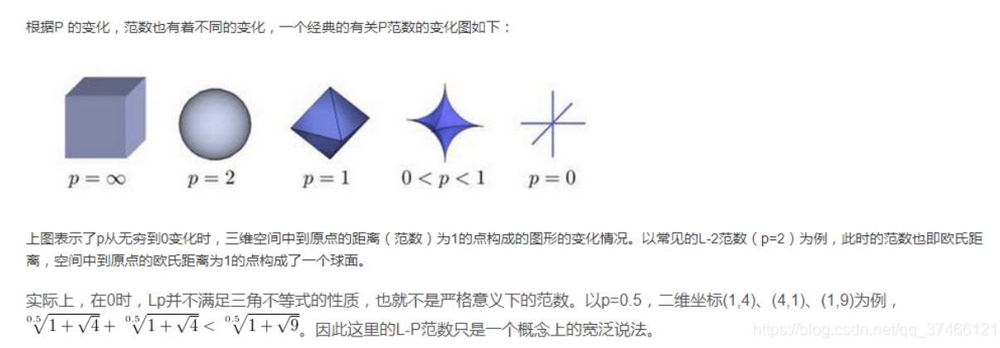

# 范数

来源 [CSDN](https://blog.csdn.net/qq_37466121/article/details/87855185)
## 1. 定义

**范数，是具有“距离”概念的函数**。我们知道距离的定义是一个宽泛的概念，只要满足**非负、自反、三角不等式就可以称之为距离。范数是一种强化了的距离概念**，它在定义上比距离多了一条**数乘**的运算规则。有时候为了便于理解，我们可以把范数当作距离来理解。

## 2. 范数的一般定义： $L_p$
```math
L_p = \|X\|_P = \sqrt[P] { \\sum_{i=1}^{n} x_i^P}, X =\{ X_1,X_2,...,X_n \}
```

  


## 3. $L_0$ 范数
当 P=0 时，也就是 $L_0$ 范数，由上面可知，**L0范数并不是一个真正的范数**，它主要被用来度量向量中非零元素的个数。用上面的$L_P$定义可以得到的 $L_0$ 的定义为：

```math
\|X\| _0= \sqrt[0]{\sum_{i=1}^{n} x _i^0}
```

***$L_0$ 范数就用来表示向量$X$中非零值的个数***

## 4. $L_1$范数
表示向量x中非零元素的绝对值之和:

```math
\|X\| _1= \sum_{i=1}^{n}|x _i|
```

L1范数有很多的名字，例如我们熟悉的 **曼哈顿距离、最小绝对误差**等。使用 **L1范数可以度量两个向量间的差异，如绝对误差和（Sum of Absolute Difference）**：

$$SAD(x_1,x_2)=\sum_i^n|x_{1i}-x_{2i}|$$ 

## 5. $L_2$范数
L2范数是我们最常见最常用的范数了，我们用的最多的度量**距离欧氏距离就是一种L2范数**，它的定义如下：

```math
\|X\| _2= \sqrt{\sum_{i=1}^{n}x_i^2}
```

**像L1范数一样，L2也可以度量两个向量间的差异**.

**L2范数通常会被用来做优化目标函数的正则化项，防止模型为了迎合训练集而过于复杂造成过拟合的情况，从而提高模型的泛化能力**。

## 6. $L_{\infty}$范数
当 $p=\infty$ 时，也就是 $L_{\infty}$ 范数，它主要被用来**度量向量元素的最大值**，与 $L_0$ 一样，通常情况下表示为:

$$\|X\|_{\infty} = max(|x_i|)$$ 

## 7. $L_1$ 和 $L_2$ 的区别
1. $L_1$ 范数（ $L_1$ norm）是指向量中各个元素绝对值之和，也有个美称叫“**稀疏规则算”（Lasso regularization**）。  

    比如 向量 $A$=[1，-1，3]， 那么 $A$ 的 $L_1$ 范数为 |1|+|-1|+|3|.

    简单总结一下就是：  
    - $L_1$ 范数: 为 $x$ 向量各个元素绝对值之和。  
    - $L_2$ 范数: 为 $x$ 向量各个元素平方和的1/2次方， $L_2$ 范数又称Euclidean范数或者Frobenius范数  
    - $L_p$ 范数: 为 $x$ 向量各个元素绝对值 $p$ 次方和的 $\frac{1}{p}$ 次方.

2. **$L_1$正则化产生稀疏的权值,$L_2$正则化产生平滑的权值为什么会这样？**  

    在支持向量机学习过程中， $L_1$ 范数实际是一种对于成本函数求解最优的过程，因此， $L_1$ 范数正则化通过向成本函数中添加 $L_1$ 范数，使得学习得到的结果满足**稀疏化**，从而方便提取特征。  
$L_1$ 范数可以使权值稀疏，方便特征提取。  $L_2$ 范数可以防止过拟合，提升模型的泛化能力。 

3. **$L_1$和$L_2$正则先验分别服从什么分布**   

    $L_1$ 是[拉普拉斯](https://so.csdn.net/so/search?q=%E6%8B%89%E6%99%AE%E6%8B%89%E6%96%AF&spm=1001.2101.3001.7020)分布，$L_2$ 是高斯分布。